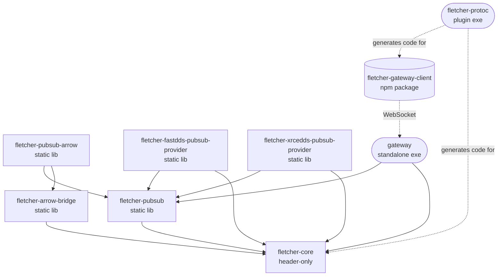

# fletcher

Multi-component C++ workspace. Each top-level directory is an independent component with its own version, CI workflow, and release cycle. Most components are Conan packages; a few are standalone executables or TypeScript libraries that do not publish a Conan recipe.

| Directory | Artifact | Type |
|---|---|---|
| `core/` | `fletcher-core` (Conan) | header-only library |
| `pubsub/` | `fletcher-pubsub` (Conan) | static library |
| `arrow-bridge/` | `fletcher-arrow-bridge` (Conan) | static library |
| `pubsub-arrow/` | `fletcher-pubsub-arrow` (Conan) | static library |
| `fastdds-pubsub-provider/` | `fletcher-fastdds-pubsub-provider` (Conan) | static library |
| `xrcedds-pubsub-provider/` | `fletcher-xrcedds-pubsub-provider` (Conan) | static library |
| `protoc/` | `fletcher-protoc` (Conan) | application (protoc plugin) |
| `gateway/` | `gateway` exe | standalone executable (no Conan package) |
| `gateway-client-ts/` | `fletcher-gateway-client` (npm) | TypeScript library |

Each component has its own `README.md` covering how to build, test and consume it. The `gateway/` directory ships only an exe — its `conanfile.py` is a local build driver and is never uploaded; consumers integrate through the WebSocket protocol, not a linkable artifact.

### Dependency graph

Build-time (Conan / npm) edges are solid; runtime edges (WebSocket, code-gen) are dashed. External deps (protobuf, Arrow, Boost, FastDDS, Micro XRCE-DDS, nlohmann_json, nanoarrow) are omitted — see each component's `README.md` for the exact set.



---

## Conventions

One rule per topic, applied across every component. Pick these up when adding a new component or reviewing a PR.

### Package names

| Ecosystem | Pattern | Example |
|---|---|---|
| Conan | `fletcher-<component>` | `fletcher-core`, `fletcher-arrow-bridge` |
| npm | `fletcher-<component>` | `fletcher-gateway-client` |

No `eiva-` prefix. The Fletcher project is independent and LGPL-3.0; package metadata stays neutral. EIVA's role as the project's origin is captured in [`AUTHORS`](AUTHORS), not in package names or descriptions.

### CMake targets

Every Conan recipe exposes its CMake target as `<conan-name>::<conan-name>` via `cmake_file_name` / `cmake_target_name`. The underlying `add_library` / `add_executable` target uses the same string, so the file written to disk (`libfletcher-pubsub.a` etc.) matches the name CMake consumers link against:

```cmake
find_package(fletcher-core CONFIG REQUIRED)
target_link_libraries(my-target PRIVATE fletcher-core::fletcher-core)
```

Pick the Conan name once; reuse it for the recipe `name`, the CMake config file, the imported-target alias, and the underlying built artifact.

### Include paths

Every first-party header lives under `include/fletcher/<component_snake>/` and is consumed as:

```cpp
#include <fletcher/<component_snake>/<header>.hpp>
```

`<component_snake>` is the directory name with hyphens replaced by underscores:

| Directory | Header prefix |
|---|---|
| `core/` | `fletcher/core/` |
| `pubsub/` | `fletcher/pubsub/` |
| `arrow-bridge/` | `fletcher/arrow_bridge/` |
| `pubsub-arrow/` | `fletcher/pubsub_arrow/` |
| `fastdds-pubsub-provider/` | `fletcher/fastdds_pubsub_provider/` |
| `xrcedds-pubsub-provider/` | `fletcher/xrcedds_pubsub_provider/` |

A single prefix removes any chance of collision with third-party headers, and a reader seeing `#include <fletcher/...>` knows immediately the header is internal to Fletcher. `protoc-gen-fletcher` emits the same prefix in its generated `.fletcher.pb.h` files. Components that do not install public headers (e.g. `protoc/`, whose `include/` is internal to the plugin build) are not required to follow this layout.

### C++ namespace

All first-party code lives under `namespace fletcher { ... }`. No `eiva::` parent, no per-component nesting unless the component genuinely wants one — `fletcher::gateway` is the only nested namespace in use today, scoped to gateway-internal helpers.

### Code style

| Language | Tool | Config |
|---|---|---|
| C / C++ | `clang-format` (Google base, 4-space indent, 100-col, c++20) | [`.clang-format`](.clang-format) |
| TypeScript / JavaScript / JSON | `prettier` (printWidth 100, single quotes, semi, trailing-comma all) | [`.prettierrc`](.prettierrc) + [`.prettierignore`](.prettierignore) |

The devcontainer ships both tools pre-installed (`clang-format` via apt, `prettier` as a global npm package), pinned to the same versions the CI checks use. The bundled VS Code extension recommendations (`xaver.clang-format` + `esbenp.prettier-vscode`) wire up format-on-save out of the box, so converging on the style takes zero contributor effort — every save reformats the file, and CI's `format-check-cpp` / `format-check-ts` workflows are a safety net rather than a blocker.

To reformat the whole tree manually:

```bash
# C++
git ls-files '*.cpp' '*.hpp' '*.h' '*.cc' \
  | grep -v -E 'pubsub/third_party/|\.fletcher\.(arrow\.)?pb\.h$' \
  | xargs clang-format -i
```

```bash
# TS/JS/JSON
npx prettier --write '**/*.{ts,tsx,js,mjs,cjs,json}' --ignore-path .prettierignore
```

Static-analysis lint (`clang-tidy` / `eslint`) is intentionally out of scope here — those are tracked as separate work.

---

## Development environment

A single devcontainer at `.devcontainer/` covers every Fletcher component. Component READMEs assume you are running inside it.

### VS Code (recommended)

Open the repository root in VS Code and select **Reopen in Container** (or run `Dev Containers: Reopen in Container` from the Command Palette). The image ships with CMake, Conan, GCC 13, Node, and the formatters preinstalled — no `postCreateCommand` runs.

Conan profiles live in [`.conan-profiles/`](.conan-profiles) in the repo. Build commands pass them by relative path (`-pr:a=../.conan-profiles/<profile>`), so no profile-install step is needed and the dev profile set always matches what CI uses.

Released Fletcher packages are attached as assets on GitHub Releases — see
[Consuming a released Conan package](#consuming-a-released-conan-package)
below. No private Conan remote login is required.

Then follow each component's README for the component-specific build, test, and consumption commands.

### Manual Docker

If you don't use VS Code, run an interactive shell directly. Build the image once:

```bash
docker build -t fletcher-build .devcontainer
```

Start a shell with the repo mounted:

```bash
docker run --rm -it -v $(pwd):/workspace -w /workspace fletcher-build bash
```

No further setup is needed — Conan profiles live in [`.conan-profiles/`](.conan-profiles) in the repo and are referenced by relative path. `cd <component>` and follow the build / test commands the component README documents.

### CI devcontainer image

Every component workflow that needs the Linux toolchain begins with a `setup-devcontainer` job that calls the reusable `setup-devcontainer-image` workflow (`.github/workflows/setup-devcontainer-image.yml`). That job builds the devcontainer image and pushes it to Harbor:

```
dockerrepo.eiva.com/fletcher/devcontainer:<git-sha>
```

`dockerrepo.eiva.com/fletcher/devcontainer:cache` keeps a BuildKit layer cache between runs. When a push to `main` actually rebuilds the image — the workflow only triggers on pushes touching `.devcontainer/**` or `setup-devcontainer-image.yml` itself — the new image also gets tagged `:main` so subsequent PRs that do not touch those paths prime their build from a known-good baseline.

Every `setup-devcontainer` invocation shares the concurrency group `setup-devcontainer-image-<sha>` with `queue: max`, so when many component workflows trigger on the same commit the build jobs run one-at-a-time in FIFO order. Only the first one actually runs `buildx`; the rest see the SHA-tagged image already in Harbor (a cheap `docker manifest inspect`) and skip the build entirely. One `ubuntu:24.04` pull per commit, not one per component workflow.

The Linux jobs that consume the toolchain pull the image via the `pull-devcontainer-image` composite action (`.github/actions/pull-devcontainer-image`) and retag it locally as `fletcher-build`. No `buildx` runs on the consumer jobs, so they never pull `ubuntu:24.04` themselves and never compete for the Docker Hub free-tier rate limit.

Harbor is the destination today because the secrets are already in place and the registry is reachable from the runner pool. Switching to a public OCI registry (e.g. ghcr.io) only requires changing the registry URL in `setup-devcontainer-image.yml` and `pull-devcontainer-image/action.yml`.

---

## Releasing

Releases are cut by pushing a **component-prefixed git tag**. The matching
`release-<component>.yml` workflow runs builds on Windows + Linux and, if
both succeed, creates a GitHub Release with the build artefacts attached.
For Conan-package components the tag must match the version in the
package's `conanfile.py`; `gateway/` has no conanfile version so the tag
itself is the version.

### Release assets

| Component type | Attached assets |
|---|---|
| Conan-package (7 components) | `fletcher-<name>-{linux,windows}-conan-package.tgz` — `conan cache save` exports, one per build profile |
| `gateway/` | `gateway.exe` (raw Windows binary) + `gateway-linux.tar.gz` (Linux binary with exec bit preserved inside the tarball) |

### Tag format

```
<component>-v<MAJOR>.<MINOR>.<PATCH>[-<pre-release>]
```

| Component | Tag prefix | Example |
|---|---|---|
| `core/` | `core-v` | `core-v0.1.0-alpha` |
| `protoc/` | `protoc-v` | `protoc-v0.1.0-alpha` |
| `pubsub/` | `pubsub-v` | `pubsub-v0.1.0-alpha` |
| `arrow-bridge/` | `arrow-bridge-v` | `arrow-bridge-v0.1.0-alpha` |
| `pubsub-arrow/` | `pubsub-arrow-v` | `pubsub-arrow-v0.1.0-alpha` |
| `fastdds-pubsub-provider/` | `fastdds-pubsub-provider-v` | `fastdds-pubsub-provider-v0.1.0-alpha` |
| `xrcedds-pubsub-provider/` | `xrcedds-pubsub-provider-v` | `xrcedds-pubsub-provider-v0.1.0-alpha` |
| `gateway/` | `gateway-v` | `gateway-v0.1.0-alpha` |

`gateway-client-ts/` does not yet release through tag-push CI.

The component prefix is required so that pushing a tag triggers exactly one
package's workflow — not all of them.

### Cutting a release

1. Bump the package's version in `<component>/conanfile.py` and merge to `main`.
2. From `main`, tag and push:

   ```bash
   git fetch origin
   ```

   ```bash
   git checkout main
   ```

   ```bash
   git pull
   ```

   ```bash
   git tag <component>-v<version>
   ```

   ```bash
   git push origin <component>-v<version>
   ```

   Example for `core` 0.1.1-alpha (next bump after the current 0.1.0-alpha):

   ```bash
   git tag core-v0.1.1-alpha
   ```

   ```bash
   git push origin core-v0.1.1-alpha
   ```

3. Watch the matching `release-<component>` workflow run on
   [GitHub Actions](https://github.com/eivacom/Fletcher/actions). Its
   `upload` job creates a GitHub Release tagged `<component>-v<version>`
   with the platform-specific assets attached.

### Notes

- For Conan-package components, the tag and `conanfile.py` version **must
  match**. The release workflow verifies this via
  `actions/verify-tag-version` and fails fast if they differ. `gateway/`
  has no conanfile version, so the tag itself is the version.
- Re-releasing an existing version requires either deleting the existing
  GitHub Release (and tag) first or bumping the version — `gh release
  create` refuses to overwrite an existing release.
- Releases are independent per component. Bumping `core` does not require
  re-releasing the others.
- Pre-release suffixes (`-alpha`, `-beta`, `-rc1`, …) are part of the
  version and go into the tag.

### Consuming a released Conan package

Each Conan-package component publishes two archives as GitHub Release assets:

| File | Built for |
|---|---|
| `fletcher-<component>-linux-conan-package.tgz` | Linux x86_64, GCC 13, libstdc++ (release profile) |
| `fletcher-<component>-windows-conan-package.tgz` | Windows x86_64, MSVC 194 (release profile) |

Each archive is produced by `conan cache save` and contains the full
Conan package (recipe revision + built binary). To consume one from
another project's Conan cache:

```bash
gh release download core-v0.1.0-alpha --repo eivacom/Fletcher --pattern 'fletcher-core-linux-conan-package.tgz'
```

```bash
conan cache restore fletcher-core-linux-conan-package.tgz
```

```python
# In your conanfile.py:
self.requires("fletcher-core/0.1.0-alpha")
```

`conan cache restore` registers the package under the exact profile it
was built with (Linux-gcc13-x86_64-Release / Windows-msvc194-x86_64-Release).
Consumers targeting a different profile must build the package from
source with `conan create <component>` against the Fletcher checkout.

---

## License

Fletcher is licensed under the GNU Lesser General Public License v3.0
or later (LGPL-3.0-or-later). The full license text is in
[`LICENSE`](LICENSE). Every Fletcher source file carries an
`SPDX-License-Identifier: LGPL-3.0-or-later` header for
machine-readable attribution.

LGPL-3.0 incorporates GPL-3.0 by reference, so binary redistributors
that fall under LGPL section 3(b) need a copy of the GPL-3.0 text in
addition to `LICENSE`. The Fletcher source repo ships only `LICENSE`
(LGPL); the GPL-3.0 text is available verbatim at
<https://www.gnu.org/licenses/gpl-3.0.txt>.

Copyright is held by "The Fletcher Authors" collectively — the people
and organisations listed in [`AUTHORS`](AUTHORS). The project was
started by EIVA A/S in 2026 and is open to outside contributions
under the same license.

Third-party code vendored under `pubsub/third_party/nanoarrow/`
(nanoarrow, including the flatcc sources bundled inside its
amalgamation) is distributed under its own upstream licenses and is
not re-licensed by Fletcher's headers.
