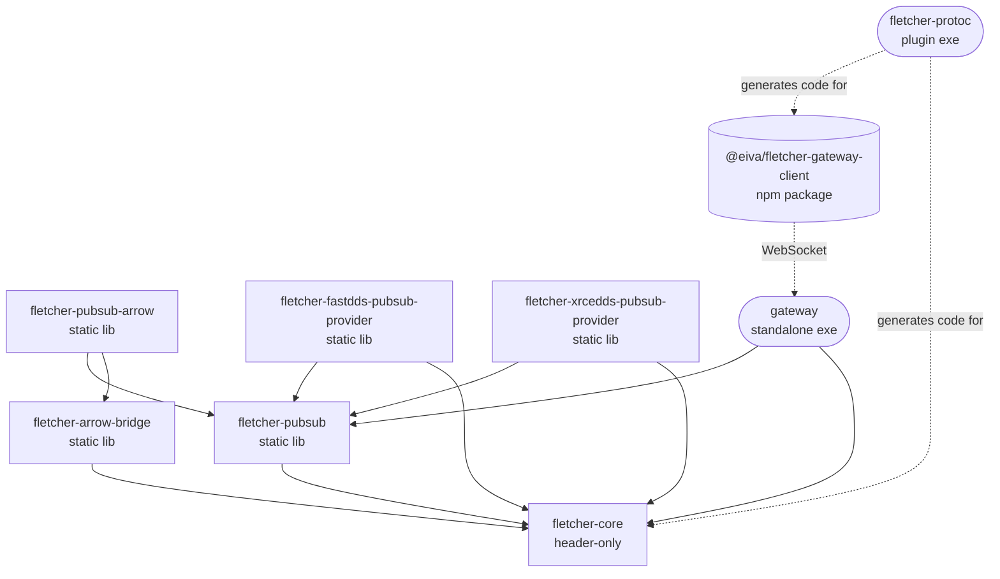

# Fletcher

**Arrow-native row serialization and pub/sub — from edge sensors to the browser.**

[](LICENSE)
[](https://www.npmjs.com/package/@eiva/fletcher-gateway-client)

Fletcher bridges two worlds: **Protocol Buffers** for message definition and **Apache Arrow** for in-memory analytics. You describe your data once in a `.proto` file; a `protoc` plugin generates typed C++ and TypeScript code that serializes each message into a compact, positional binary row backed by an Arrow schema. Those rows are built for data that *arrives* one row at a time — telemetry streams, event buses, sensor networks — but is *consumed* in columnar batches for analytics, storage, or forwarding.

The same encoded bytes flow unchanged from a microcontroller publishing over DDS, through a server decoding with Apache Arrow C++, to a browser rendering live data over WebSocket — with no format conversion at any hop.

Fletcher began as part of EIVA's upcoming NaviSuite 5 architecture for marine surveying and inspection operations, which adopts a fully Arrow-based data model end to end. Because every customer integrating with NaviSuite 5 needs Fletcher — and because the library is entirely self-contained and useful well beyond the survey-and-inspection domain — we have chosen to open-source it. Fletcher is an integral part of that architecture, so it is continuously maintained and supported; outside contributions are very welcome and actively encouraged.

---

## Contents

- [Why Fletcher](#why-fletcher)
- [How it works](#how-it-works)
- [Quick start](#quick-start)
- [Use cases](#use-cases)
- [Repository layout](#repository-layout)
- [Documentation](#documentation)
- [Building from source](#building-from-source)
- [Consuming a released package](#consuming-a-released-package)
- [Roadmap](#roadmap)
- [Contributing](#contributing)
- [Releasing](#releasing)
- [License](#license)

---

## Why Fletcher

- **Arrow-native from the start.** Every row is defined by an Arrow schema. The generated code, the wire format, and the pub/sub layer all speak Arrow types — no intermediate representations, no impedance mismatch between edge and server.
- **Edge-compatible by default.** The core publish/subscribe path depends only on [nanoarrow](https://arrow.apache.org/nanoarrow/) (~100 KB). Heavyweight Apache Arrow C++ is a separate, server-only tier. Edge binaries stay tiny (publish + subscribe in well under 75 KB of flash).
- **Code generation over boilerplate.** Your `.proto` file is the single source of truth. `protoc-gen-fletcher` emits typed C++ message classes, Arrow view classes, and TypeScript interfaces — no hand-written serialization, no schema drift across languages.
- **Transport-agnostic pub/sub.** One `PubSub` interface decouples encoding from transport. Implementations ship for Fast DDS (desktop/server), Micro XRCE-DDS (MCU/embedded), and WebSocket (browser). Adding MQTT, Zenoh, or a custom transport means implementing one interface — no codec or generated-code changes.
- **Zero-copy where it matters.** Publishers encode directly into the transport's buffer; subscribers decode in place. The `PositionalWriter`/`PositionalReader` pair runs without allocation on the hot path.
- **Schema transport, not self-description.** The wire format omits field numbers, type tags, and schema hashes — fields are written in schema order with a compact null bitfield. Schemas are delivered to subscribers out-of-band, so there is near-zero per-row overhead (~14 bytes for a typical 10-field row).

## How it works

Fletcher is organized into **two deployment tiers that share one wire format**:

- **Edge tier** (nanoarrow only): generated message classes, the `PubSub` interface, positional I/O, the `Driver` (fan-out / subscriptions), the DDS transport providers, and the WebSocket gateway.
- **Server tier** (adds Apache Arrow C++): the `Codec` for Arrow scalar encode/decode, the `pubsub-arrow` convenience adapter, and generated zero-copy view classes over `RecordBatch`/`Table`.

A row encoded by `PositionalWriter` on an edge device decodes byte-for-byte through `Codec` on a server, and vice versa. Each layer is independent — use the codec without pub/sub, the gateway without DDS, or the full pipeline end to end.



Solid edges are build-time (Conan / npm) dependencies; dashed edges are runtime (WebSocket) or code-generation relationships. For the full picture see the [Architecture Overview](docs/architecture-overview.md).

## Quick start

### 1. Define a message

```protobuf
// telemetry.proto
syntax = "proto3";
package myapp;

import "google/protobuf/empty.proto";

message SensorReading {
    int32  sensor_id        = 1;
    double temperature      = 2;
    string location         = 3;
    optional double humidity = 4;   // nullable in the Arrow schema
}

service SensorFeed {
    rpc Stream(stream SensorReading) returns (google.protobuf.Empty);
}
```

### 2. Generate code

`protoc-gen-fletcher` runs as a normal protoc plugin during your CMake build. For each `.proto` it emits:

| Generated file | Depends on | Contents |
|---|---|---|
| `telemetry.fletcher.pb.h` | nanoarrow only | Arrow schema function, typed row class, publisher/subscriber |
| `telemetry.fletcher.arrow.pb.h` | Apache Arrow C++ | Immutable view class with typed getters, `ToArrowRow()` |
| `telemetry.fletcher.ts` | — | TypeScript interface, schema descriptor, topic constant |

See [`protoc/README.md`](protoc/README.md) for wiring the plugin into your build.

### 3. Encode and decode (edge tier — no Arrow C++)

```cpp
#include "telemetry.fletcher.pb.h"

// Build a row with typed, chainable setters.
fletcher_gen::myapp::SensorReading row;
row.set_sensor_id(42)
   .set_temperature(23.5)
   .set_location("Room 101")
   .set_humidity(55.3);

// Encode to a compact positional buffer.
fletcher::EncodedRow encoded = row.Encode();

// Reconstruct from raw bytes.
fletcher_gen::myapp::SensorReading restored(encoded);
```

### 4. Publish and subscribe (over DDS)

```cpp
#include <fletcher/fastdds_pubsub_provider/fast_dds_pubsub_provider.hpp>

auto provider = std::make_shared<fletcher::FastDDSPubSubProvider>();

// Publisher — creates the topic with its Arrow schema, then zero-copy encodes.
fletcher_gen::myapp::SensorFeed_StreamPublisher pub(provider);
pub.Publish(row);

// Subscriber — receives a typed message, decoded from raw bytes.
fletcher_gen::myapp::SensorFeed_StreamSubscriber sub(provider);
sub.Subscribe([](fletcher_gen::myapp::SensorReading msg, fletcher::Attachments att) {
    std::cout << "temperature = " << msg.temperature() << "\n";
});
```

Swap `FastDDSPubSubProvider` for `XrceDDSPubSubProvider` to publish from an MCU/embedded node — the generated publisher/subscriber code is identical.

### 5. Consume in the browser

Run the [`gateway`](gateway/README.md) to expose the pub/sub layer over WebSocket, then use the generated TypeScript bindings with the client:

```ts
import { FletcherClient } from '@eiva/fletcher-gateway-client';
import { SensorReading, SensorFeed_StreamTopic } from './telemetry.fletcher.js';

const client = new FletcherClient({ url: 'ws://localhost:9090' });
await client.connect();

// `row` is typed as the generated SensorReading interface; the schema is
// discovered automatically on subscribe.
await client.subscribe(SensorFeed_StreamTopic, SensorReading, (row, attachments) => {
    console.log(row.temperature, row.location);
});
```

See [`gateway-client-ts/README.md`](gateway-client-ts/README.md) for the full client API.

## Use cases

- **Sensor telemetry capture.** During a survey or inspection mission, sensors stream measurements that must be serialized and transported reliably over a vessel network. Fletcher gives you low per-row overhead, reliable DDS delivery, and guaranteed publisher/subscriber schema agreement.
- **Edge and embedded devices.** MCUs and embedded gateways publish Arrow-typed data without linking Apache Arrow C++ — the nanoarrow tier plus XRCE-DDS fits in a tiny footprint, and an XRCE-DDS Agent bridges the data into the full DDS network where desktop/server subscribers consume it.
- **Browser visualization.** Live data reaches browser clients over WebSocket. The pure-TypeScript codec decodes the positional wire format into typed objects with no WASM requirement, and schemas are delivered automatically on subscription.

## Repository layout

Each top-level directory is an independent component with its own version, CI workflow, and release cycle. Most are Conan packages; a few are standalone executables or TypeScript libraries.

| Directory | Artifact | Type |
|---|---|---|
| [`core/`](core/README.md) | `fletcher-core` (Conan) | header-only library — positional I/O, envelope, types |
| [`pubsub/`](pubsub/README.md) | `fletcher-pubsub` (Conan) | static library — `PubSub` interface, `Driver`, schema transport |
| [`arrow-bridge/`](arrow-bridge/README.md) | `fletcher-arrow-bridge` (Conan) | static library — server-side `Codec`, `ArrowRowView` |
| [`pubsub-arrow/`](pubsub-arrow/README.md) | `fletcher-pubsub-arrow` (Conan) | static library — Arrow C++ convenience over the nanoarrow provider |
| [`fastdds-pubsub-provider/`](fastdds-pubsub-provider/README.md) | `fletcher-fastdds-pubsub-provider` (Conan) | static library — Fast DDS transport |
| [`xrcedds-pubsub-provider/`](xrcedds-pubsub-provider/README.md) | `fletcher-xrcedds-pubsub-provider` (Conan) | static library — Micro XRCE-DDS transport |
| [`protoc/`](protoc/README.md) | `fletcher-protoc` (Conan) | application — the `protoc-gen-fletcher` plugin |
| [`gateway/`](gateway/README.md) | `gateway` exe | standalone WebSocket server (no Conan package) |
| [`gateway-client-ts/`](gateway-client-ts/README.md) | `@eiva/fletcher-gateway-client` (npm) | TypeScript client library |

Each component's `README.md` covers how to build, test, and consume it. `gateway/` ships only an exe — consumers integrate through its WebSocket protocol, not a linkable artifact.

## Documentation

The [`docs/`](docs/README.md) directory holds the full architecture documentation. Start with the overview and drill in as needed:

| Document | What it covers |
|---|---|
| [Architecture Overview](docs/architecture-overview.md) | Vision, design principles, two-tier architecture, components, data flow |
| [Component & Dependency Diagram](docs/component-diagram.md) | System context, component detail, dependency graph |
| [Data Flow Diagrams](docs/data-flow-diagrams.md) | Encode/decode, publish/subscribe, schema transport, browser delivery |
| [Wire Format Specification](docs/wire-format-specification.md) | Positional wire format, proto→Arrow type mapping, nullability, envelope |
| [Technology Decision Log](docs/technology-decisions.md) | Rationale for the key technology choices (TD-001 … TD-007) |

The proto→Arrow type mapping and the `(fletcher.flatten)` schema-flattening option are documented in [`docs/fletcher-options.md`](docs/fletcher-options.md) and the wire-format spec.

## Building from source

### Prerequisites

- **CMake** 3.15+
- **Conan** 2
- A **C++20** compiler (GCC 12+, Clang 15+, or MSVC 2022)
- **Node.js** 24+ (only for `gateway-client-ts`)

A ready-to-use devcontainer (CMake, Conan, GCC 13, Node, formatters) lives at [`.devcontainer/`](.devcontainer/) — see [CONTRIBUTING.md](CONTRIBUTING.md#development-environment) for "Reopen in Container" and manual-Docker instructions.

### C++ components

There is no top-level build — each component is created independently into the local Conan cache, and downstream components resolve against it. Build in dependency order:

```bash
conan create core/.                    --build=missing -pr:a=.conan-profiles/Linux-gcc13-x86_64-Release
conan create arrow-bridge/.            --build=missing -pr:a=.conan-profiles/Linux-gcc13-x86_64-Release
conan create pubsub/.                  --build=missing -pr:a=.conan-profiles/Linux-gcc13-x86_64-Release
conan create pubsub-arrow/.            --build=missing -pr:a=.conan-profiles/Linux-gcc13-x86_64-Release
conan create protoc/.                  --build=missing -pr:a=.conan-profiles/Linux-gcc13-x86_64-Release
conan create fastdds-pubsub-provider/. --build=missing -pr:a=.conan-profiles/Linux-gcc13-x86_64-Release
conan create xrcedds-pubsub-provider/. --build=missing -pr:a=.conan-profiles/Linux-gcc13-x86_64-Release
```

Each `conan create` builds and runs that component's tests. Profiles for Linux (GCC 13) and Windows (MSVC 194) live in [`.conan-profiles/`](.conan-profiles/).

### TypeScript client

```bash
cd gateway-client-ts
npm install
npm test          # vitest suite
npm run build     # tsc compilation
```

## Consuming a released package

Each Conan-package component attaches two archives to its GitHub Release — one per build profile:

| File | Built for |
|---|---|
| `fletcher-<component>-linux-conan-package.tgz` | Linux x86_64, GCC 13, libstdc++ (release) |
| `fletcher-<component>-windows-conan-package.tgz` | Windows x86_64, MSVC 194 (release) |

Each archive is a `conan cache save` export (recipe revision + built binary). To consume one:

```bash
gh release download core-v0.3.0-alpha --repo eivacom/Fletcher \
  --pattern 'fletcher-core-linux-conan-package.tgz'
conan cache restore fletcher-core-linux-conan-package.tgz
```

```python
# In your conanfile.py:
self.requires("fletcher-core/0.3.0-alpha")
```

`conan cache restore` registers the package under the exact profile it was built with. To target a different profile, build from source with `conan create <component>` against a Fletcher checkout.

The `gateway-client-ts` package is published to npm as [`@eiva/fletcher-gateway-client`](https://www.npmjs.com/package/@eiva/fletcher-gateway-client) (`npm install @eiva/fletcher-gateway-client`).

## Roadmap

Fletcher is at an early (`0.3.x-alpha`) stage. Planned work, roughly in priority order:

- **Dynamically loadable transport plugins.** Make transport providers (Fast DDS, XRCE-DDS, …) loadable at runtime as plugins, so an application can pick a transport without compile-time coupling to its library.
- **A protocol bridge service.** A standalone service that loads two transport plugins and bridges traffic between them — e.g. relay XRCE-DDS telemetry from an embedded segment onto a Fast DDS backbone, or DDS onto WebSocket — without bespoke glue code.
- **GeoArrow-compliant schemas.** Ship reference `.proto` definitions for geometry types that, via the `(fletcher.flatten)` option, generate [GeoArrow](https://geoarrow.org/)-compliant Arrow schemas out of the box.
- **Conan Center distribution.** Build and publish the Fletcher Conan packages to [Conan Center](https://conan.io/center) so consumers can depend on them without restoring release archives manually.

## Contributing

Contributions are welcome under the project's LGPL-3.0-or-later license. See [CONTRIBUTING.md](CONTRIBUTING.md) for the development environment, coding conventions (license headers, namespaces, naming, formatting), and the pull-request workflow. Open an issue first for non-trivial changes.

## Releasing

Releases are cut by maintainers by pushing a **component-prefixed git tag** (`<component>-v<MAJOR>.<MINOR>.<PATCH>[-<pre-release>]`). The matching `cd.<component>.yml` workflow builds on Windows + Linux and, on success, creates a GitHub Release with the artifacts attached (or runs `npm publish` for the TypeScript client).

| Component | Tag prefix | Version source |
|---|---|---|
| `core/` … `xrcedds-pubsub-provider/` (7 Conan components) | `<component>-v` | `<component>/conanfile.py` |
| `gateway/` | `gateway-v` | `gateway/VERSION` |
| `gateway-client-ts/` | `gateway-client-v` | `gateway-client-ts/package.json` |

For Conan and gateway components the tag version **must match** the version source (CI verifies and fails fast otherwise). Pre-release suffixes (`-alpha`, `-beta`, `-rc1`, …) are part of the version and, for the npm client, select the dist-tag.

### Version scheme — `MAJOR.MINOR` signals compatibility

Every Fletcher component follows `MAJOR.MINOR.PATCH`, and **`MAJOR.MINOR` is a cross-component compatibility marker**: all components that share the same `MAJOR.MINOR` are designed, built, and tested to interoperate as one coherent set. Components carrying the same `MAJOR.MINOR` — regardless of their individual `PATCH` levels — are guaranteed compatible across the build graph (Conan dependencies), the wire format, and the generated-code / gateway-client contracts. The current line is **`0.3.x-alpha`**.

- **`MAJOR` / `MINOR` — moves in lockstep.** A new compatibility series is cut by bumping every component to the same new `MAJOR.MINOR` (e.g. `0.3.x` → `0.4.x`), even components with no source change, so the shared line stays unambiguous. A `MAJOR` bump signals a breaking change to a public API, the wire format, or the gateway protocol; a `MINOR` bump signals backward-compatible additions within the series. Mixing components from different `MAJOR.MINOR` lines is unsupported.
- **`PATCH` — moves independently per component.** Bug fixes and other changes that preserve compatibility within the current series advance only the affected component's `PATCH`. So `fletcher-core/0.3.2-alpha` and `fletcher-pubsub/0.3.5-alpha` are an expected, supported combination; their matching `0.3` says they belong together.

In short: **match `MAJOR.MINOR` across the packages you combine; let `PATCH` float.** The pinned `self.requires("fletcher-…/0.3.0-alpha")` lines in each `conanfile.py` record the exact set a release was validated against, while the shared `0.3` is the compatibility contract.

### Shipping a bug fix (patch bump)

A bug fix stays *within* the current compatibility series, so it touches only the affected component's `PATCH`. Crucially, **the fix is branched from the release tag being patched — not from `main`** — because `main` has usually moved on (newer patches, or work toward a future series) and you want to ship the fix on top of *exactly* what was released, with nothing else pulled in:

1. **Branch off the release tag** for the version you are patching — e.g. `git switch -c hotfix/pubsub-0.3.1 pubsub-v0.3.0-alpha`. This gives you the released tree and nothing newer.
2. **Fix and test** the change on that branch. Do not touch the `MAJOR.MINOR` of the component or anything else in the tree.
3. **Bump the `PATCH`** in that component's version source (`conanfile.py`, `gateway/VERSION`, or `package.json`) — e.g. `fletcher-pubsub/0.3.0-alpha` → `0.3.1-alpha`. Leave the other components alone.
4. **Tag the new patch and release.** Push the tag (`pubsub-v0.3.1-alpha`); CI verifies the tag matches the version source, builds on Windows + Linux, and publishes the artifact. The release ships straight from the hotfix branch.
5. **Cherry-pick the fix back into `main`** (`git cherry-pick <fix-commit>`) so the fix is not lost in the next series. If `main` is already on a newer version, carry over only the code fix — resolve the version-source bump to whatever `main`'s component version should be (don't blindly overwrite it with `0.3.1-alpha`).

Because the `MAJOR.MINOR` is unchanged, `fletcher-pubsub/0.3.1-alpha` drops straight into any existing `0.3.x` deployment — consumers that float `PATCH` pick it up with no coordination. Only bump a dependant's pinned `self.requires(...)` if it must adopt the fix immediately; otherwise the shared `0.3` already guarantees compatibility.

### Implementing a breaking change

A breaking change — to a public API, the wire format, or the gateway protocol — requires a new `MAJOR.MINOR` series. The work does **not** have to land in one atomic commit across all nine packages; instead it is developed and shipped as **pre-release (`-alpha` / `-beta`) packages**, and the rule that *all* `MAJOR.MINOR` numbers match is relaxed **only during that development phase**:

1. **Branch** off `main` for the breaking work — e.g. `feature/0.4-typed-envelope`.
2. **Bump the leading components** to the new series as **pre-releases** as they change — e.g. `fletcher-core/0.4.0-alpha`, then `fletcher-pubsub/0.4.0-alpha` once it adopts the new core. Components that have not yet been migrated may remain on the previous series (`0.3.x`). **During development the `MAJOR.MINOR` numbers are allowed to diverge** across the tree — this is expected while the new series is being built out.
3. **Iterate** through `-alpha` → `-beta` → `-rc` pre-releases as the change stabilizes. Pre-release packages are explicitly opt-in for consumers (Conan requires `include_prerelease`; npm uses the matching dist-tag), so divergence here never reaches anyone consuming official releases.
4. **Promote to an official release** only once **every** component has been migrated onto the new line and the whole set is green. At promotion the divergence must be resolved: **all components are aligned to the same `MAJOR.MINOR`** (e.g. the entire tree is on `0.4.x`), the pinned `self.requires(...)` lines are re-pinned to the new series, and the pre-release suffix is dropped (or advanced to the agreed release suffix). The lockstep-`MAJOR.MINOR` invariant is therefore enforced for **official releases only** — pre-releases are the staging ground where the new series is assembled.

The guiding rule: **official releases always have matching `MAJOR.MINOR` across the packages; pre-release (`-alpha`/`-beta`) series may diverge while a breaking change is under construction, and the divergence is closed at promotion.**

## License

Fletcher is licensed under the **GNU Lesser General Public License v3.0 or later** (LGPL-3.0-or-later). The full text is in [`LICENSE`](LICENSE), and every source file carries an `SPDX-License-Identifier: LGPL-3.0-or-later` header.

LGPL-3.0 incorporates GPL-3.0 by reference; the GPL-3.0 text is available at <https://www.gnu.org/licenses/gpl-3.0.txt>. Copyright is held collectively by "The Fletcher Authors" listed in [`AUTHORS`](AUTHORS). The project was started by EIVA A/S in 2026 and is open to outside contributions under the same license.

Third-party code vendored under `pubsub/third_party/nanoarrow/` (nanoarrow, including the bundled flatcc sources) is distributed under its own upstream licenses and is not re-licensed by Fletcher.
