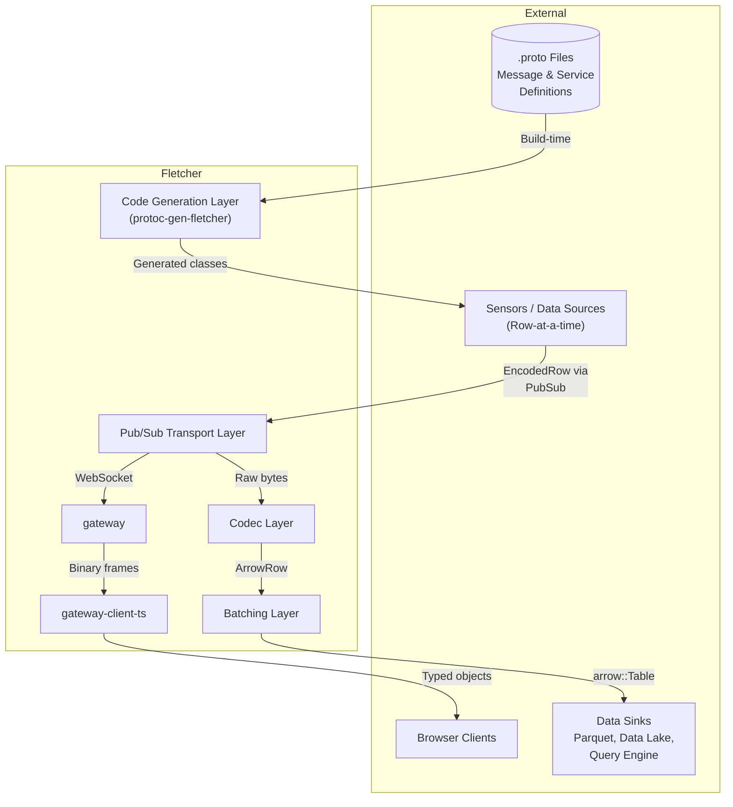
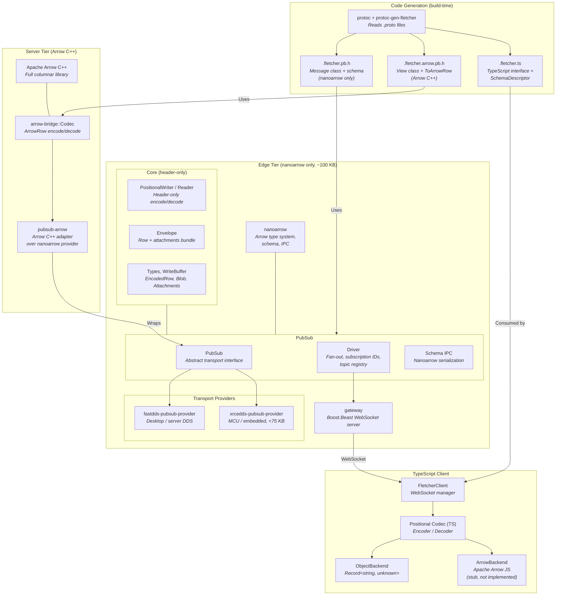
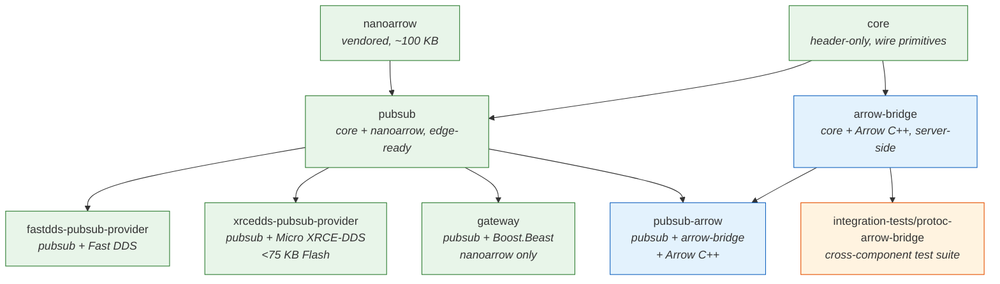
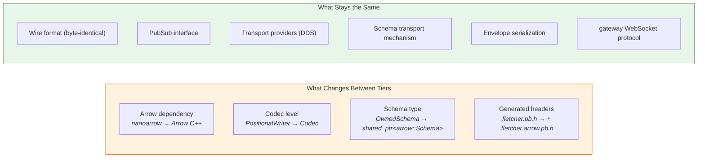

<!-- Space: Software -->
<!-- Parent: Architecture Overview -->
<!-- Title: Component and Dependency Diagram -->

# Component and Dependency Diagram

## System Context

## Component Detail

## Dependency Graph

Legend:
- Green: edge tier (nanoarrow only)
- Blue: server tier (Arrow C++)
- Orange: test-only

## Two-Tier Deployment

## Project Structure

The monorepo is a polyrepo of Conan packages — each top-level directory is its own `conanfile.py`, built independently into the local Conan cache. The TypeScript packages get a `-ts` suffix so the language is obvious from a directory listing.

```mermaid
graph TB
    subgraph root ["Fletcher/"]
        direction TB
        ROOT_README["README.md<br/><i>Top-level repo overview + TODO backlog</i>"]
        DOCS["docs/<br/><i>Architecture documentation</i>"]
        WORKFLOWS[".github/workflows/<br/><i>fletcher-&lt;component&gt;.yml<br/>per-component CI</i>"]

        subgraph core_dir ["core/"]
            CORE_INC["include/core/<br/><i>Types, WriteBuffer,<br/>PositionalIO, Envelope</i>"]
            CORE_TEST["tests/"]
        end

        subgraph pubsub_dir ["pubsub/"]
            PS_INC["include/pubsub/<br/><i>Provider, Driver, OwnedSchema</i>"]
            PS_SRC["src/"]
            PS_TEST["tests/"]
        end

        subgraph ab_dir ["arrow-bridge/"]
            AB_INC["include/arrow_bridge/<br/><i>Codec, ArrowRowView,<br/>CRS utils</i>"]
            AB_SRC["src/"]
            AB_TEST["tests/"]
        end

        subgraph psa_dir ["pubsub-arrow/"]
            PSA_INC["include/pubsub_arrow/<br/><i>Arrow C++ adapter</i>"]
            PSA_TEST["tests/"]
        end

        subgraph plugin_dir ["protoc/"]
            PP_SRC["src/<br/><i>generator, type_mapper, main</i>"]
            PP_TEST["tests/"]
        end

        subgraph integ_dir ["integration-tests/protoc-arrow-bridge/"]
            PI_PROTO["proto/<br/><i>Per-scenario .proto files</i>"]
            PI_TEST["tests/<br/><i>Per-scenario test files</i>"]
        end

        subgraph dds_dir ["fastdds-pubsub-provider/"]
            DDS_ALL["<i>Full DDS provider</i>"]
        end

        subgraph xrce_dir ["xrcedds-pubsub-provider/"]
            XRCE_ALL["<i>XRCE-DDS provider</i>"]
        end

        subgraph webgw_dir ["gateway/"]
            WG_ALL["<i>WebSocket server + example</i>"]
        end

        subgraph webcl_dir ["gateway-client-ts/"]
            WC_ALL["<i>TypeScript client<br/>(npm: eiva-fletcher-gateway-client)</i>"]
        end
    end
```

