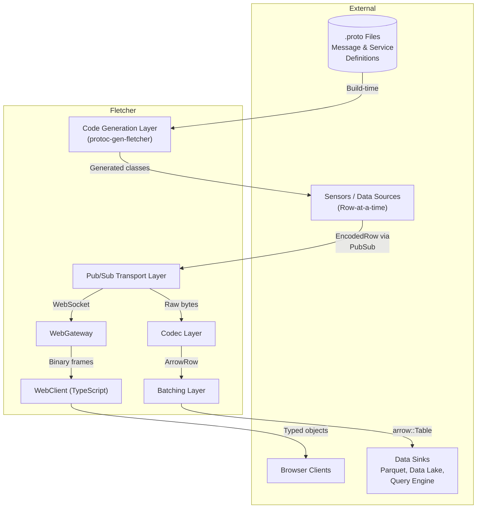
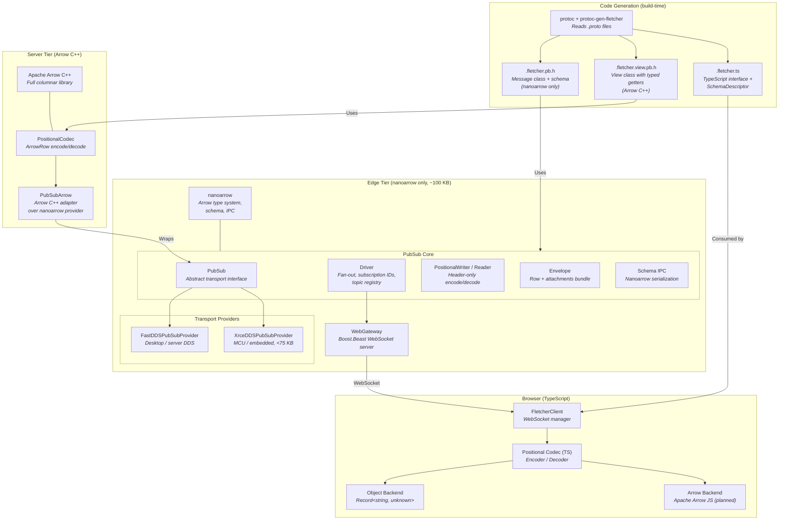
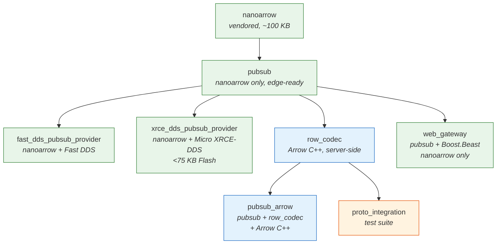
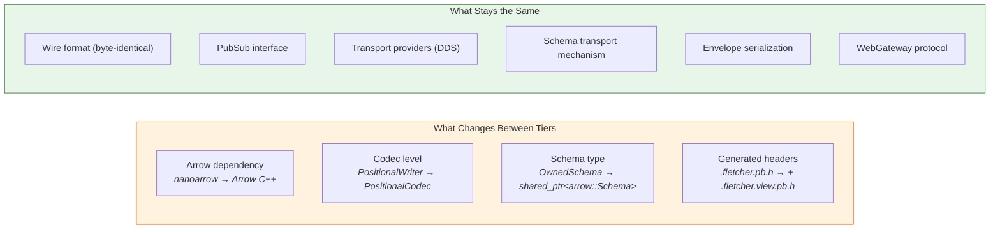

<!-- Space: Software -->
<!-- Parent: Architecture Overview -->
<!-- Title: Component and Dependency Diagram -->

# Component and Dependency Diagram

## System Context

## Component Detail

## Dependency Graph

Legend:
- Green: edge tier (nanoarrow only)
- Blue: server tier (Arrow C++)
- Orange: test-only

## Two-Tier Deployment

## Project Structure

```mermaid
graph TB
    subgraph root ["ArrowRowSerializer/"]
        direction TB
        CMAKE["CMakeLists.txt<br/><i>Root build, Conan integration</i>"]
        CONAN["conanfile.txt<br/><i>Dependencies</i>"]

        subgraph third ["third_party/"]
            NANO_V["nanoarrow/<br/><i>Vendored amalgamation</i>"]
        end

        subgraph pubsub_dir ["PubSub/"]
            PS_INC["include/pubsub/<br/><i>Provider, Driver, OwnedSchema,<br/>WriteBuffer, PositionalIO,<br/>Envelope, Types</i>"]
            PS_SRC["src/"]
            PS_TEST["tests/ (24 cases)"]
        end

        subgraph codec_dir ["Codec/"]
            C_INC["include/<br/><i>PositionalCodec, RowCodec,<br/>ArrowRowView, C API</i>"]
            C_SRC["src/"]
            C_TEST["tests/ (92 cases)"]
            C_RUST["bindings/rust/"]
        end

        subgraph psa_dir ["PubSubArrow/"]
            PSA_INC["include/pubsub_arrow/<br/><i>PubSubArrow adapter</i>"]
            PSA_TEST["tests/ (7 cases)"]
        end

        subgraph plugin_dir ["ProtoPlugin/"]
            PP_SRC["src/<br/><i>generator, type_mapper, main</i>"]
            PP_TEST["tests/ (36 cases)"]
        end

        subgraph integ_dir ["ProtoIntegration/"]
            PI_PROTO["proto/<br/><i>Test .proto files</i>"]
            PI_TEST["tests/ (76 cases)"]
        end

        subgraph dds_dir ["FastDDSPubSubProvider/"]
            DDS_ALL["<i>Full DDS provider</i>"]
        end

        subgraph xrce_dir ["XrceDDSPubSubProvider/"]
            XRCE_ALL["<i>XRCE-DDS provider</i>"]
        end

        subgraph webgw_dir ["WebGateway/"]
            WG_ALL["<i>WebSocket server + example</i>"]
        end

        subgraph webcl_dir ["WebClient/"]
            WC_ALL["<i>TypeScript client (37 tests)</i>"]
        end
    end
```

