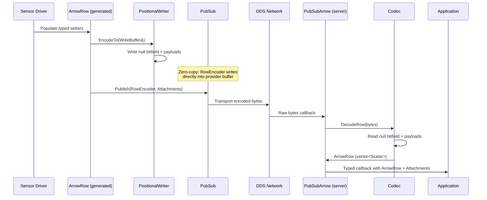
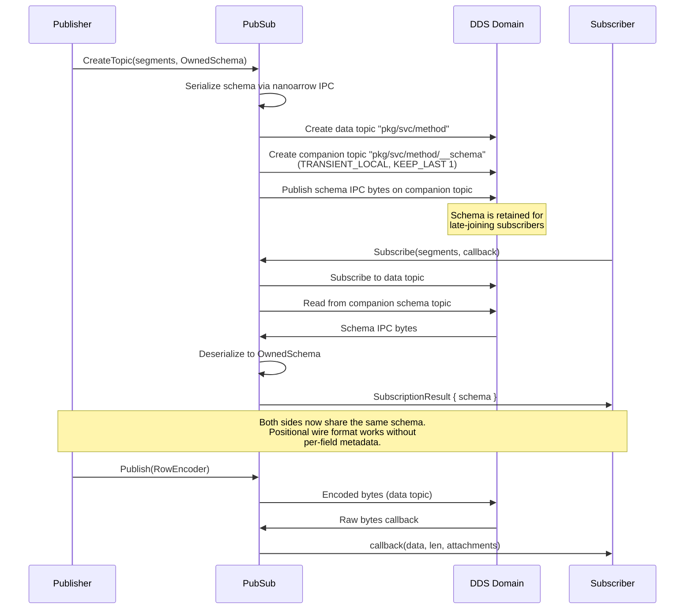
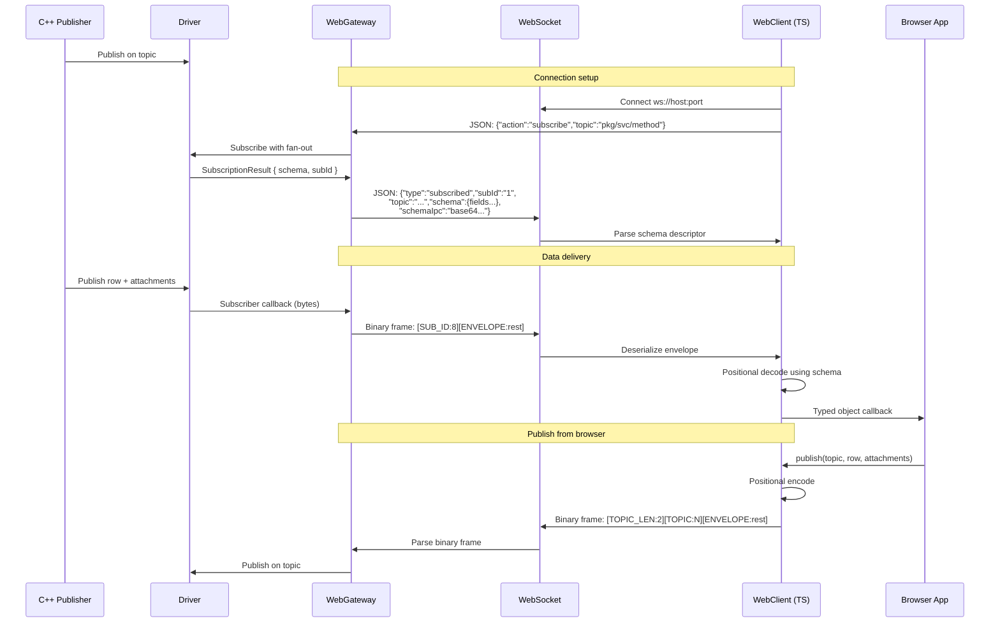
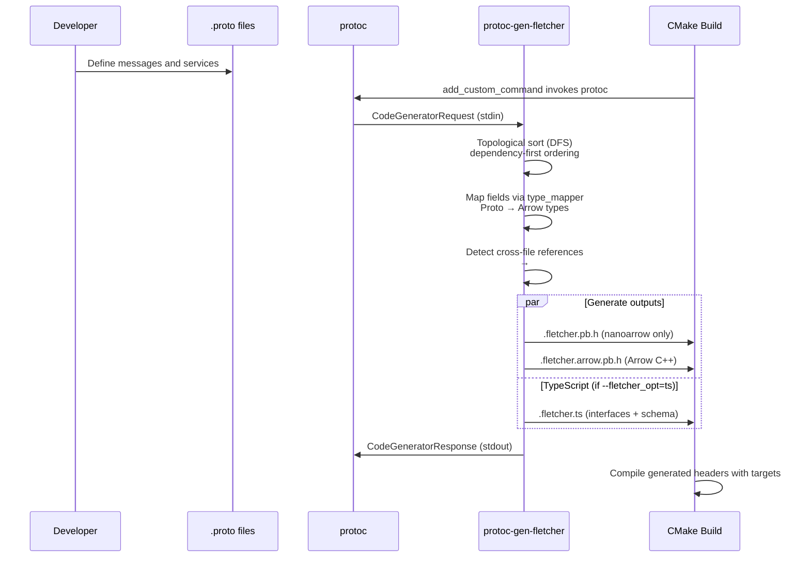
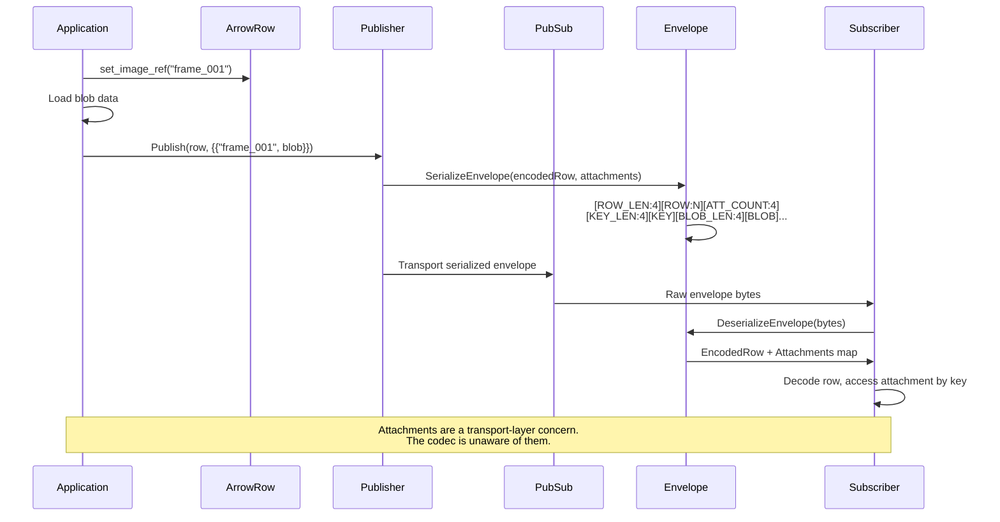
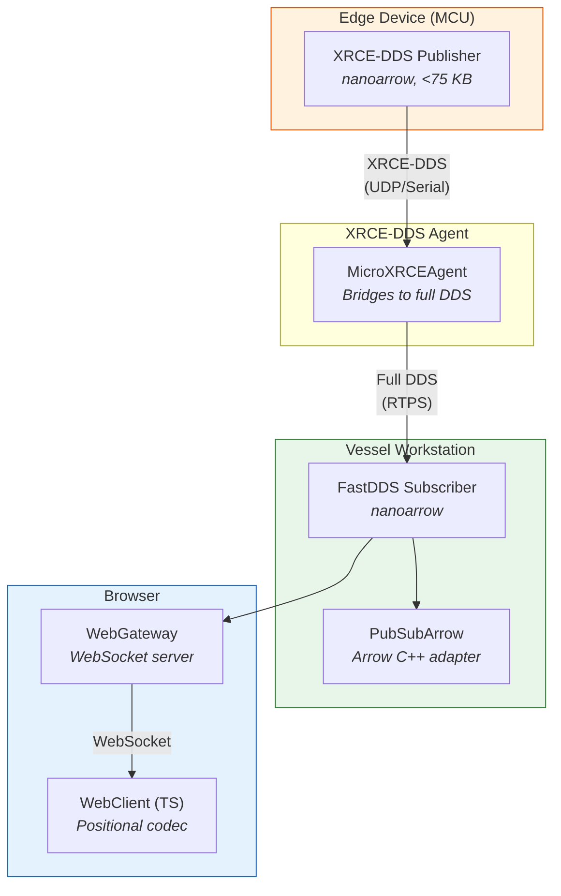

<!-- Space: Software -->
<!-- Parent: Architecture Overview -->
<!-- Title: Data Flow Diagrams -->

# Data Flow Diagrams

## Sensor-to-Subscriber Pipeline

## Schema Transport Flow

## Browser Delivery Flow (WebGateway)

## Code Generation Flow

## Attachment (Sidecar Blob) Flow

## Multi-Provider Interoperability

