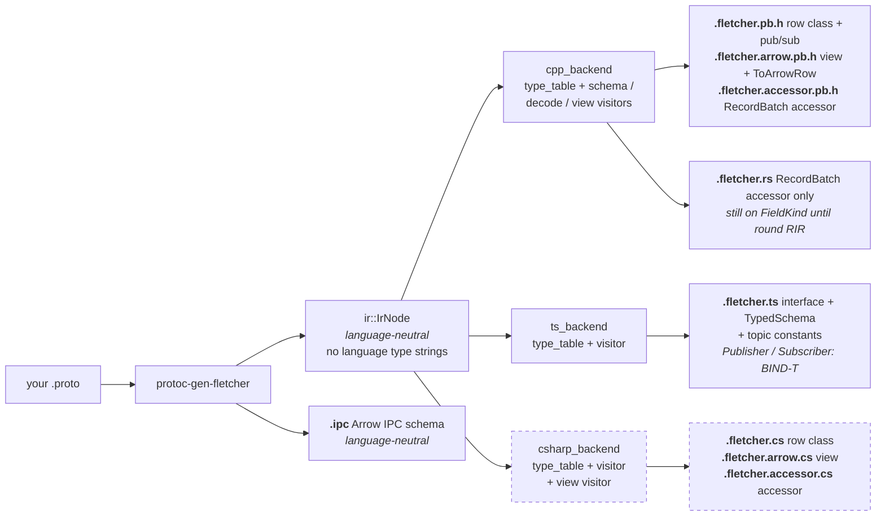
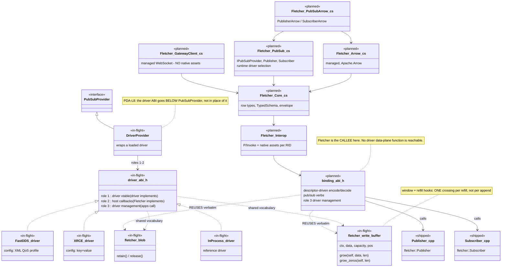
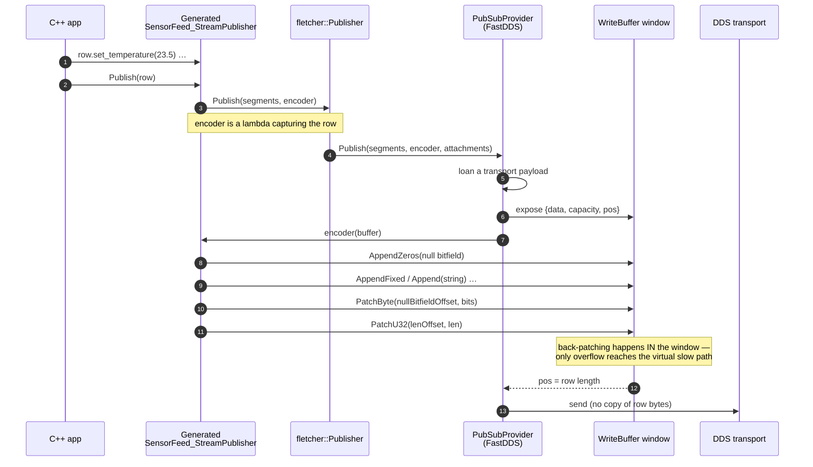
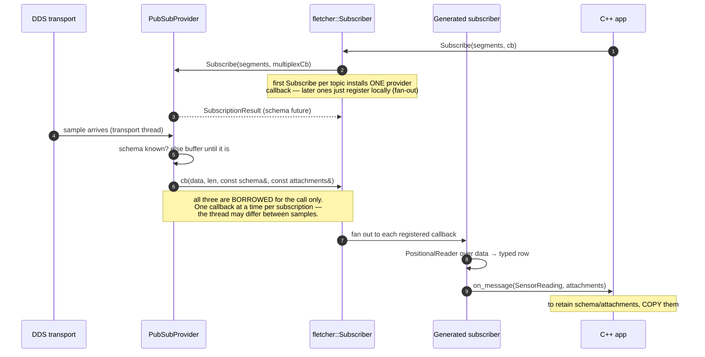
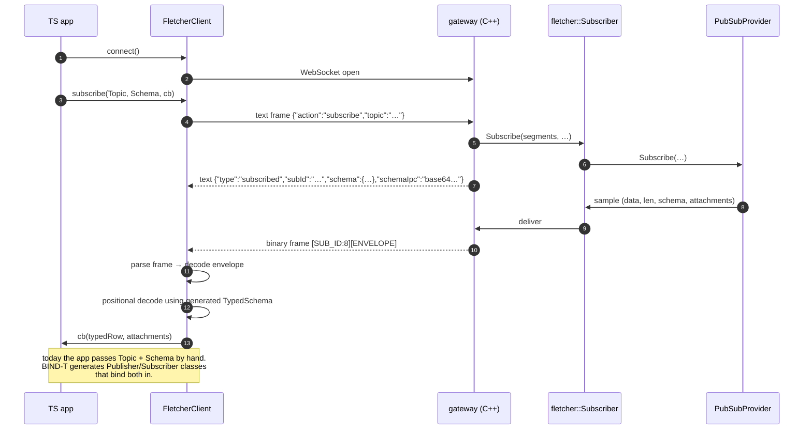
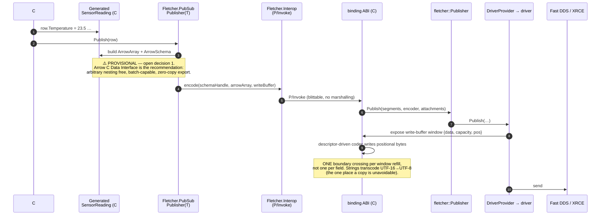
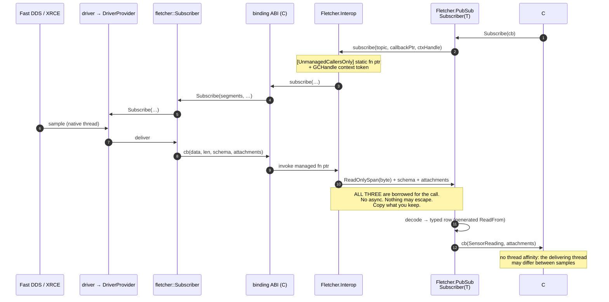
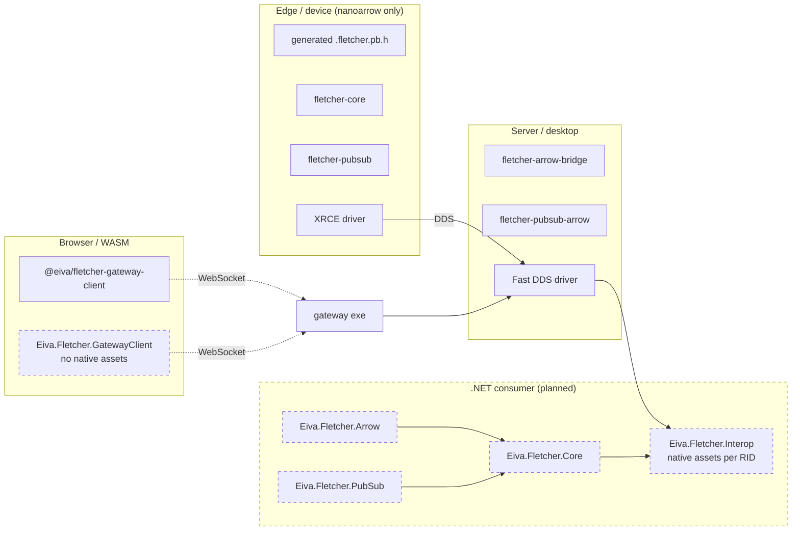

# Fletcher — Architecture & Data-Flow Diagrams (BIND round input)

Companion to [BIND-csharp-bindings.md](BIND-csharp-bindings.md). Diagrams are
Mermaid, so this file renders directly on GitHub, in VS Code, and in any Mermaid-
aware Markdown viewer.

> ⚠️ **Read the legend first.** This document deliberately mixes three maturity
> levels. Treating a planned box as existing code would be the main way to misread
> it.

## Legend

| Marker | Meaning |
|---|---|
| `<<shipped>>` | Exists on `main` today (`8ef1d0e`) and is tested in CI |
| `<<in-flight>>` | Round **PDA**, on `feature/protocol-driver-abi` — **design documents only, no ABI code written yet**, 8 commits ahead of `main`, unmerged |
| `<<planned>>` | Round **BIND** — this plan. **Nothing exists yet.** |
| `<<provisional>>` | Planned *and* the design is still an open decision |

## Language support — what actually exists today

This matters for reading the sequence diagrams: only C++ has a complete pub/sub
path right now.

| Language | Encode / decode | Publish / subscribe | Arrow read side | Status |
|---|---|---|---|---|
| **C++** | ✅ generated row classes + `Codec` | ✅ `Publisher` / `Subscriber`, all providers | ✅ views + accessors | complete |
| **TypeScript** | ✅ managed codec in `@eiva/fletcher-gateway-client` | ⚠️ via gateway WebSocket only, and **hand-wired** — no generated `Publisher`/`Subscriber` (that is BIND-T) | ❌ | partial |
| **Rust** | ❌ *(planned — BIND-Rust)* | ❌ *(planned — BIND-Rust)* | ✅ `.fletcher.rs` RecordBatch accessor | read side today |
| **C#** | ❌ | ❌ | ❌ | planned (BIND) |

**Rust has no pub/sub path *yet*.** Today the only Rust in the tree is the
generated `.fletcher.rs` accessor, which reads `RecordBatch`es something else
produced — there is no Rust codec and no Rust transport. It is absent from the
pub/sub sequence diagrams because **there is nothing to draw yet**, not because
Rust is excluded by design: PDA-L5 states verbatim that *"BIND-C#/BIND-Rust are
full pub/sub clients"*, and GIR-3 locks the chain
**GIR → BIND-C# → BIND-Rust → RIR**. Rust pub/sub is therefore **planned**, one
round behind C#, and figures 07–08 are the template it will follow.

---

## 1. Class diagram — codec and pub/sub core (shipped)

### Generated artifacts, per language

One IR, N backends — GIR's design, and the reason a C# backend is cheap.

Opt tokens: `--fletcher_opt=` `ts` · `ipc` · `accessor` · `rust` (shipped), plus
`csharp` · `csharp_accessor` (planned).

---

## 2. Class diagram — the two ABIs and the C# binding (planned + in-flight)

The two ABIs point in **opposite directions**; conflating them is the classic
mistake (PDA-L5).

---

## 3. Sequence — C++ publish (shipped)

The zero-copy path: the provider supplies the buffer window, and the generated
encoder writes positional bytes **directly into the transport payload**.

## 4. Sequence — C++ subscribe (shipped)

## 5. Sequence — TypeScript subscribe over the gateway (shipped)

Browser-safe: pure managed codec, no native code, no WASM requirement.

## 6. Sequence — C# publish (planned; one hop provisional)

## 7. Sequence — C# subscribe (planned)

---

## 8. Deployment view — which packages a consumer takes

**Why `GatewayClient` carries no native assets:** WASM cannot load them. Browser
and WASM clients must keep the managed WebSocket path, which is why D-BIND-13
isolates native assets to `Interop` alone and CI asserts `GatewayClient` has no
`runtimes/` folder.

---

## Known gaps in these diagrams

1. **The binding ABI's function set is not designed yet.** Diagrams 2, 6 and 7 show
   the *shape* agreed so far, not a reviewed header. The value-transfer hop in
   diagram 6 is explicitly marked provisional (open decision 1).
2. **PDA is design-only.** No driver ABI code exists; `DriverProvider`,
   `fletcher_write_buffer` and the three drivers are from the spec, and the spec is
   still moving (it changed on 2026-08-31).
3. **`InProcessProvider` is not a component yet** — it lives inside
   `gateway/src/main.cpp`. PDA-L9 promotes it.
4. **Rust is absent from the pub/sub diagrams** because it has no pub/sub path
   *yet*. It is **planned** (BIND-Rust, one round after BIND-C#), not excluded by
   design — see the support table above.
5. **`FastDDSProviderOptions` still exists.** Diagram 2 shows Fast DDS configured by
   XML profile, which is the PDA-L9 target state, **not** today's code.
