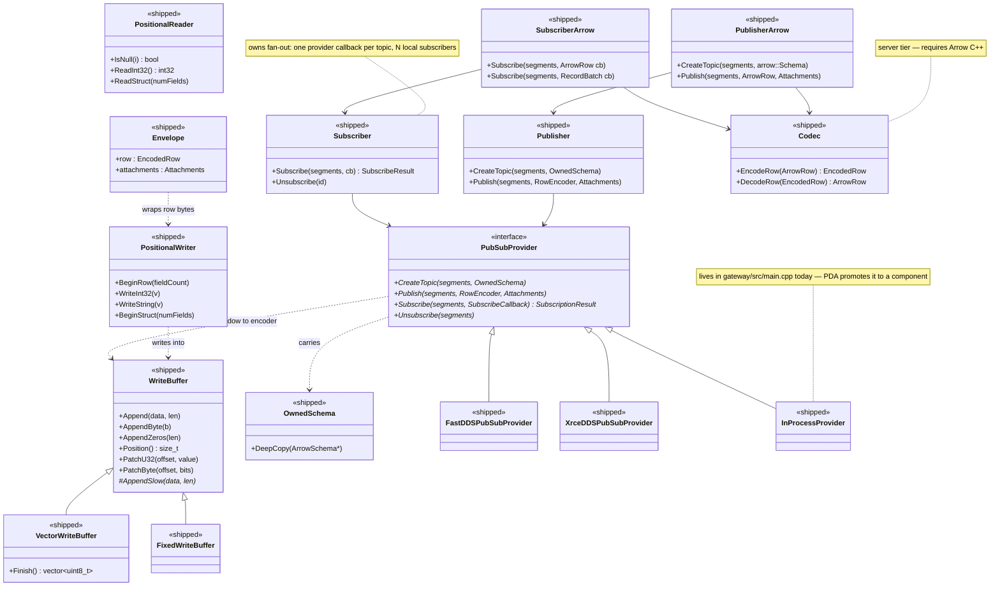
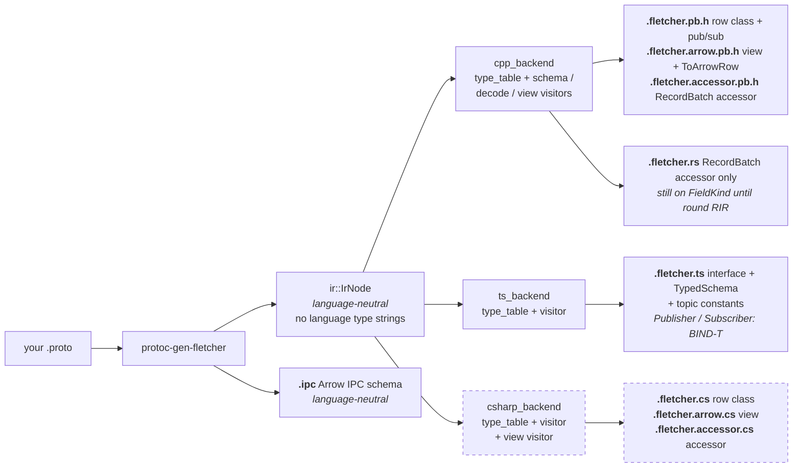
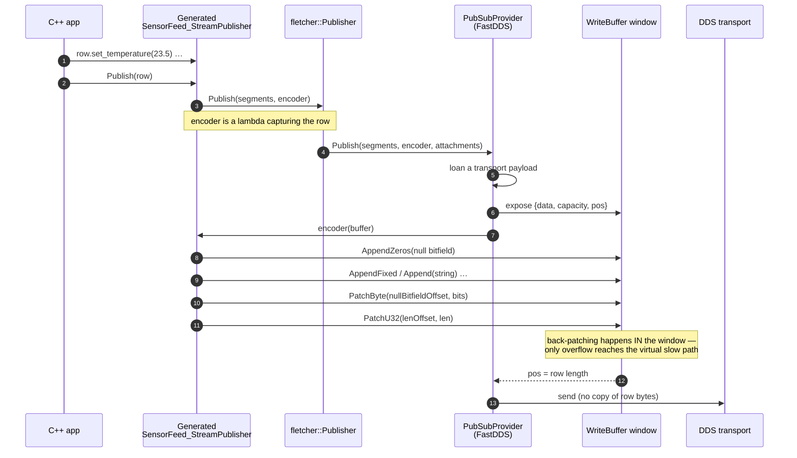
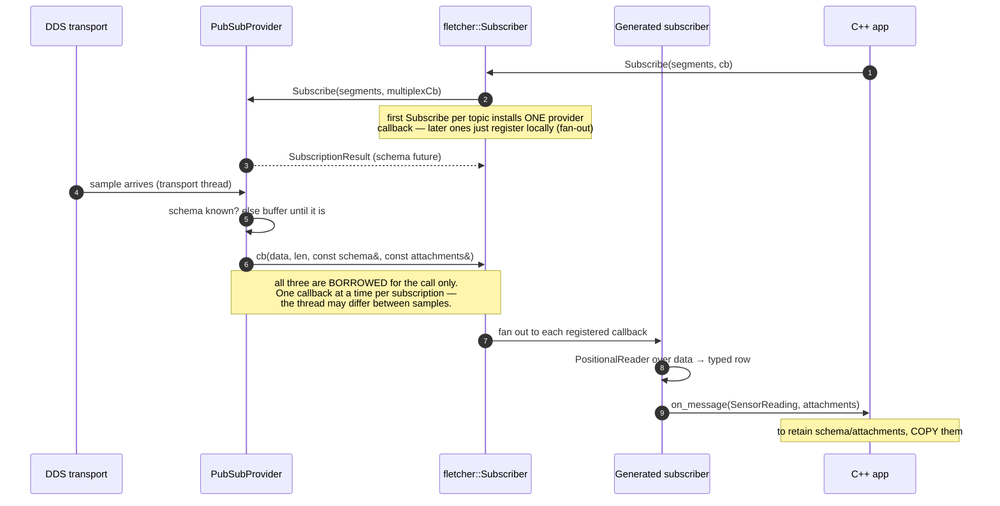
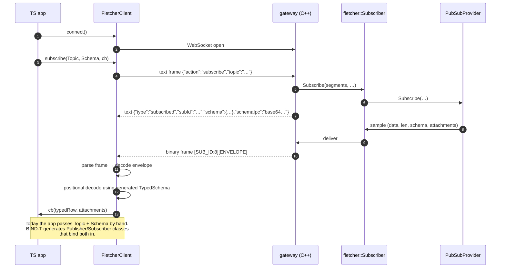
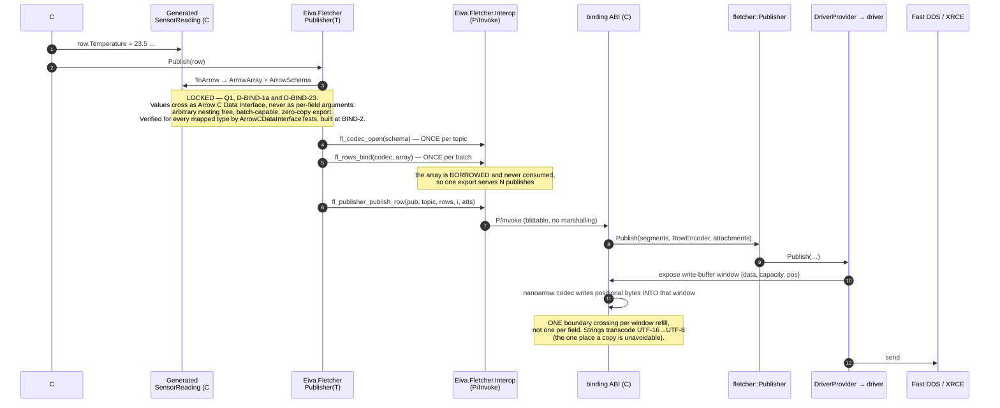
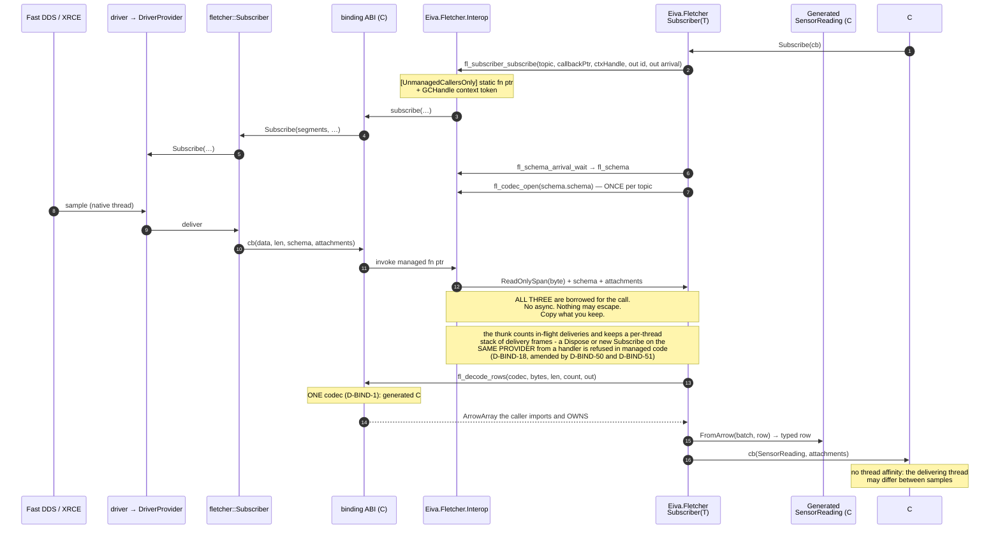
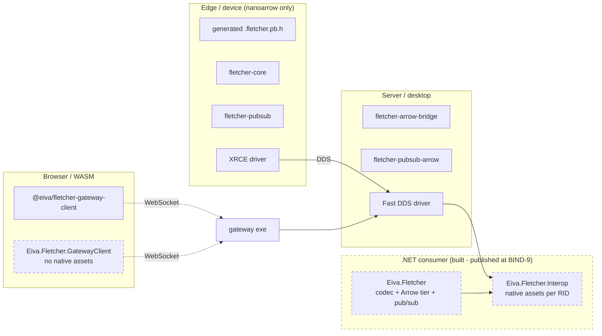

# Fletcher — Architecture & Data-Flow Diagrams (BIND round input)

Companion to [BIND-csharp-bindings.md](BIND-csharp-bindings.md). Diagrams are
Mermaid, so this file renders directly on GitHub, in VS Code, and in any Mermaid-
aware Markdown viewer.

> ⚠️ **Read the legend first.** This document deliberately mixes three maturity
> levels. Treating a planned box as existing code would be the main way to misread
> it.

> ⚠️ **This file is a DERIVATIVE record of the round's rulings, and it is the one
> that rots.** It says in pictures what the decisions digest, the tracker and the
> development plan say in prose — so a ruling that changes a shape, a name, a count
> or a direction has to sweep this file too. That is now written down as the fourth
> place in [BIND-locked-decisions.md](BIND-locked-decisions.md#where-a-ruling-has-to-land--four-places-not-three).
> On 2026-09-18 a sweep found **eight** claims here that a later ruling had
> invalidated, including a sequence drawing a design D-BIND-1 had explicitly
> refused. Prose that contradicts itself gets noticed; a diagram just draws the old
> design and looks authoritative doing it.
>
> **Edit by parsing, not by eye:** mermaid + jsdom, and check for CR bytes. A stray
> `;` or CR breaks rendering silently, long after the commit.

## Legend

| Marker | Meaning |
|---|---|
| `<<shipped>>` | Exists on `main` today (`8ef1d0e`) and is tested in CI |
| `<<in-flight>>` | Round **PDA**, on `feature/protocol-driver-abi` — **design documents only, no ABI code written yet**, 8 commits ahead of `main`, unmerged |
| `<<built>>` | Round **BIND**, on `feature/csharp-bindings` (draft #129) — **built and tested in CI, not yet on `main`**. Added 2026-09-25, when BIND-4 closed |
| `<<planned>>` | Round **BIND** — this plan, **not built yet** |
| `<<provisional>>` | Planned *and* the design is still an open decision |

## Language support — what actually exists today

This matters for reading the sequence diagrams: only C++ has a complete pub/sub
path right now — generated classes through to the transport. C# has pub/sub over
the shim since BIND-4, but no generated classes until BIND-6.

| Language | Encode / decode | Publish / subscribe | Arrow read side | Status |
|---|---|---|---|---|
| **C++** | ✅ generated row classes + `Codec` | ✅ `Publisher` / `Subscriber`, all providers | ✅ views + accessors | complete |
| **TypeScript** | ✅ managed codec in `@eiva/fletcher-gateway-client` | ⚠️ via gateway WebSocket only, and **hand-wired** — no generated `Publisher`/`Subscriber` (that is BIND-T) | ❌ | partial |
| **Rust** | ❌ *(planned — BIND-Rust)* | ❌ *(planned — BIND-Rust)* | ✅ `.fletcher.rs` RecordBatch accessor | read side today |
| **C#** | ✅ `FletcherCodec` over the shim *(BIND-3c, 2026-09-21)* | ✅ `Publisher` / `Subscriber` over the shim, all three built-in providers by selector *(BIND-4, 2026-09-25)* — hand-wired until BIND-6 generates classes, `SubscriberArrow` at BIND-5 | ❌ *(BIND-7)* | in progress (BIND) |

**Which codec a language reaches, and why the type sets look different
(D-BIND-39, 2026-09-21).** One wire format, **two drivers** of it:
`arrow-bridge::Codec` serves hand-written C++ that already holds arbitrary Arrow
data and carries everything the format can frame — unions, decimals, intervals,
half-float, view types, fixed-size binary. `NanoarrowCodec` inside the shim serves
**every binding** (C# today, Rust next round) and carries the **proto mapping**,
which it covers completely and then some. So **every type a generator can emit,
every language carries** — the extras are unreachable from any `.proto` (`oneof` is
in the wire spec's own §"Unsupported Types"). Dictionaries are carried by both as
of BIND-3d, per the spec's §"Dictionary Types": encoded as the **value type**, one
value per row.

**Rust has no pub/sub path *yet*.** Today the only Rust in the tree is the
generated `.fletcher.rs` accessor, which reads `RecordBatch`es something else
produced — there is no Rust codec and no Rust transport. It is absent from the
pub/sub sequence diagrams because **there is nothing to draw yet**, not because
Rust is excluded by design: PDA-L5 states verbatim that *"BIND-C#/BIND-Rust are
full pub/sub clients"*, and GIR-3 locks the chain
**GIR → BIND-C# → BIND-Rust → RIR**. Rust pub/sub is therefore **planned**, one
round behind C#, and figures 07–08 are the template it will follow.

---

## 1. Class diagram — codec and pub/sub core (shipped)

### Generated artifacts, per language

One IR, N backends — GIR's design, and the reason a C# backend is cheap.

Opt tokens: `--fletcher_opt=` `ts` · `ipc` · `accessor` · `rust` (shipped), plus
`csharp` · `csharp_accessor` (planned).

---

## 2. Class diagram — the two ABIs and the C# binding (built, planned and in-flight)

The two ABIs point in **opposite directions**; conflating them is the classic
mistake (PDA-L5).

```mermaid
classDiagram
    direction TB

    class PubSubProvider {
        <<interface>>
    }

    class DriverProvider {
        <<in-flight>>
        wraps a loaded driver
    }
    note for DriverProvider "PDA-L8: the driver ABI goes BELOW PubSubProvider, not in place of it"

    class driver_abi_h {
        <<in-flight>>
        role 1 : driver vtable (driver implements)
        role 2 : host callbacks (Fletcher implements)
        role 3 : driver management (apps call)
    }
    class fletcher_write_buffer {
        <<in-flight>>
        ctx, data, capacity, pos
        grow(self, data, len)
        grow_zeros(self, len)
    }
    note for fletcher_write_buffer "window + refill hooks: ONE crossing per refill, not per append"

    class fletcher_blob {
        <<in-flight>>
        retain() / release()
    }

    PubSubProvider <|-- DriverProvider
    DriverProvider --> driver_abi_h : roles 1-2
    driver_abi_h ..> fletcher_write_buffer : shared vocabulary
    driver_abi_h ..> fletcher_blob : shared vocabulary

    class FastDDS_driver {
        <<in-flight>>
        config: XML QoS profile
    }
    class XRCE_driver {
        <<in-flight>>
        config: key=value
    }
    class InProcess_driver {
        <<in-flight>>
        reference driver
    }
    driver_abi_h <|.. FastDDS_driver
    driver_abi_h <|.. XRCE_driver
    driver_abi_h <|.. InProcess_driver

    class binding_abi_h {
        <<built>>
        44 entry points at ABI 0.5
        codec: open, bind, encode_row, decode_rows
        registry, publisher, subscriber, schema arrival
        path selectors answer kNotSupported until PDA-ABI
    }
    note for binding_abi_h "Fletcher is the CALLEE here. No driver data-plane function is reachable. The window and blob shapes resemble the driver ABI because both are derived from the SEAM SPEC, not because either includes the other - D-BIND-2′ forbids sharing a declaration."

    binding_abi_h ..> fletcher_write_buffer : same seam vocabulary, declared separately
    binding_abi_h ..> fletcher_blob : same seam vocabulary, declared separately
    binding_abi_h --> Publisher_cpp : calls
    binding_abi_h --> Subscriber_cpp : calls

    class Publisher_cpp {
        <<shipped>>
        fletcher::Publisher
    }
    class Subscriber_cpp {
        <<shipped>>
        fletcher::Subscriber
    }

    class Fletcher_Interop {
        <<built>>
        Eiva.Fletcher.Interop
        P/Invoke, SafeHandles, exact ABI handshake
        native assets per RID at BIND-9
    }
    class Fletcher_Codec_cs {
        <<built>>
        Eiva.Fletcher - codec and Arrow tier
        FletcherCodec, BoundRows
    }
    class Fletcher_PubSub_cs {
        <<built>>
        Eiva.Fletcher - pub/sub tier
        ProviderRegistry, Publisher, Subscriber, SchemaArrival
        a provider is an opaque handle
    }
    note for Fletcher_PubSub_cs "D-BIND-24: C# never implements a provider. There is no managed provider interface, no Register and no SetPathResolver - a transport is chosen by selector string."
    class Fletcher_SubscriberArrow_cs {
        <<planned>>
        Eiva.Fletcher - SubscriberArrow, batch-first
        BIND-5. PublisherArrow folds into Publisher
    }
    class Fletcher_Generated_cs {
        <<planned>>
        generated .fletcher.cs rows
        BIND-6, writes no wire bytes
    }
    class Fletcher_GatewayClient_cs {
        <<planned>>
        Eiva.Fletcher.GatewayClient, BIND-8
        managed WebSocket - NO native assets
    }
    note for Fletcher_GatewayClient_cs "The one managed codec (D-BIND-1). Depends on Apache.Arrow only - not on Eiva.Fletcher, and not on the shim."

    Fletcher_Interop --> binding_abi_h
    Fletcher_Codec_cs --> Fletcher_Interop
    Fletcher_PubSub_cs --> Fletcher_Codec_cs
    Fletcher_PubSub_cs --> Fletcher_Interop
    Fletcher_SubscriberArrow_cs --> Fletcher_PubSub_cs
    Fletcher_SubscriberArrow_cs --> Fletcher_Codec_cs
    Fletcher_Generated_cs --> Fletcher_Codec_cs
```

The three C# packages are D-BIND-14′'s: `Eiva.Fletcher.Interop`,
`Eiva.Fletcher` (every managed tier above the interop, in ONE namespace today —
the component-named namespaces D-BIND-14′ allows were not needed) and
`Eiva.Fletcher.GatewayClient`. Until 2026-09-25 this diagram drew six boxes from
the pre-ruling design, including a managed `IPubSubProvider` that D-BIND-24
refused.

---

## 3. Sequence — C++ publish (shipped)

The zero-copy path: the provider supplies the buffer window, and the generated
encoder writes positional bytes **directly into the transport payload**.

## 4. Sequence — C++ subscribe (shipped)

## 5. Sequence — TypeScript subscribe over the gateway (shipped)

Browser-safe: pure managed codec, no native code, no WASM requirement.

## 6. Sequence — C# publish (planned; its lower half built)

**Built at BIND-4:** everything from `fl_codec_open` down, driven today by
`Publisher.Publish(topic, rows, i)` over a `BoundRows` — the generated
`SensorReading` and `Publisher(T)` at the top are BIND-6's. And the provider
is today a registered built-in (`inprocess`, `fastdds`, `xrce`), not a
`DriverProvider`: that arrives with PDA-ABI.

## 7. Sequence — C# subscribe (planned; its lower half built)

**Built at BIND-4:** the subscribe, the arrival wait, the delivery thunk and
`fl_decode_rows`, driven today by a `RowHandler` over the raw row — the
generated `Subscriber(T)` and `FromArrow` are BIND-6's. The provider caveat of
diagram 6 applies.

---

## 8. Deployment view — which packages a consumer takes

**Why `GatewayClient` carries no native assets:** WASM cannot load them. Browser
and WASM clients must keep the managed WebSocket path, which is why D-BIND-13
isolates native assets to `Interop` alone and CI asserts `GatewayClient` has no
`runtimes/` folder.

---

## Known gaps in these diagrams

*Swept 2026-09-18 against the tree, and again 2026-09-25 at BIND-4's close. Three
of the first five have closed since these diagrams were drawn on 2026-08-31; they
are marked rather than deleted, because a gap that closed is worth distinguishing
from a gap nobody re-checked.*

1. ~~**The binding ABI's function set is not designed yet.**~~ ✅ **CLOSED
   2026-09-17.** BIND-1 landed `c-abi/include/fletcher/abi/binding.h` — 912 lines then (1,013, and 44 entry
   points at ABI 0.5, once BIND-4 closed),
   pure C99, reviewed as a *specification* over two cycles
   (`plans/reviews/BIND-1-design-review.md`), with every declaration derived from
   the seam spec and its § named. The value-transfer hop that was provisional here
   is ruled: Arrow C Data Interface, three layers (D-BIND-1a, D-BIND-23), built and
   reviewed at BIND-2. Diagrams 2, 6 and 7 now show a shape that exists.
2. **PDA is design-only.** Still true: there is no driver ABI code in the tree and
   no `driver.h`, so `DriverProvider`, `fletcher_write_buffer` and the three
   *drivers* are from the spec rather than from anything built. The seam spec
   itself last moved on **2026-09-08** with PDA-DEC (#126), not 2026-08-31 as this
   said. Note the distinction the diagram keeps: `InProcess_driver` is a PDA driver
   and does not exist; `InProcessProvider` is a seam provider and does — see 3.
3. ~~**`InProcessProvider` is not a component yet.**~~ ✅ **CLOSED.** It is a real
   component of the `pubsub` package (`pubsub/src/in_process_provider.cpp`,
   `pubsub/include/fletcher/pubsub/in_process_provider.hpp`), reached through
   `RegisterInProcessProvider`, and the shim links and registers it as one of its
   three built-ins. It no longer lives in `gateway/src/main.cpp`, which now only
   *calls* the registration.
4. **Rust is absent from the pub/sub diagrams** because it has no pub/sub path
   *yet*. It is **planned** (BIND-Rust, one round after BIND-C#), not excluded by
   design — see the support table above. Still true.
5. ~~**`FastDDSProviderOptions` still exists.**~~ ✅ **CLOSED.** PDA-DEC-6 retired the
   struct — it has no definition anywhere in the tree, and its knobs are lines in
   the provider's configuration document. So diagram 2's XML-profile depiction is
   **today's code**, not a target state.
6. **Diagrams 6 and 7 draw the TARGET, not today's code** (added 2026-09-25). The
   generated C# classes at their top are BIND-6's and the `DriverProvider` at their
   bottom is PDA-ABI's. What sits between — the interop tier, the binding ABI, the
   fused publish, the delivery thunk and the decode — is built, and each diagram now
   says so above it. Diagram 2 marks the same split with `<<built>>`.
