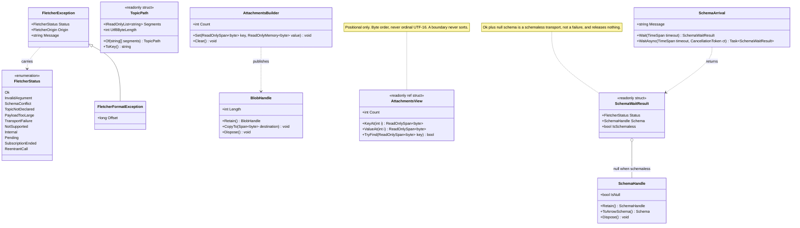
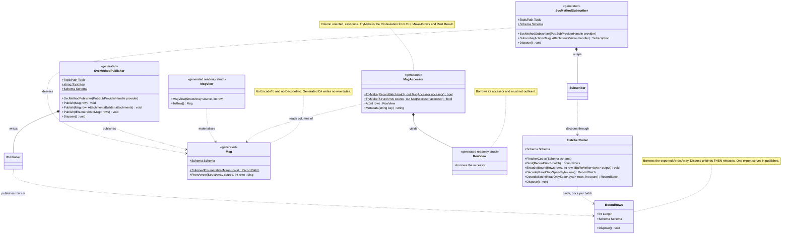
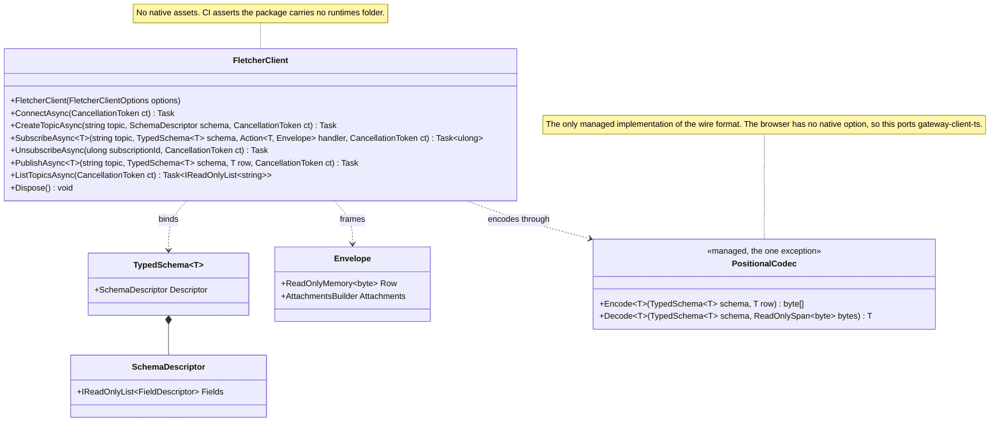

# BIND-C# — The public interfaces the binding must support

**Status: reference note for review, 2026-09-08.** Companion to
[BIND-csharp-development-plan.md](BIND-csharp-development-plan.md). Written at
`main` = `6c541e9`. It answers one question: *what is the surface a C# application
gets, and what obliges each piece of it?* It proposes names and shapes; it locks
nothing. Open questions continue the development plan's numbering, from Q13.

Every C++ surface below was read from the tree, not from the plan documents. The
seam types are **frozen** (`docs/pubsub-interface-spec.md` §12.1), so the C# shapes
that mirror them are constrained rather than chosen.

---

## §1 — Five sources of obligation

| Source | What it obliges | Frozen? |
|---|---|---|
| **A. The seam** — `docs/pubsub-interface-spec.md` §2–§8, and the headers under `pubsub/include` and `core/include` | The vocabulary (`Blob`, `Attachments`, `SharedSchema`, `SchemaArrival`, topic segments, `WriteBuffer`), the four provider methods, provider selection and configuration, the status taxonomy, the delivery and threading contract | **Yes.** A shape that cannot be mirrored is a stop-and-ask against the spec |
| **B. The caller tier** — `Publisher`, `Subscriber` | What a C# application actually holds. §9 names `CallerTier` as BIND's oracle, so this tier is the one the round is graded on | Behaviour frozen |
| **C. The Arrow tier** — `PublisherArrow`, `SubscriberArrow`, `Codec`, `ImportArrowSchema` | ADO 16353 names "codec, PubSubProvider, PubSubArrow" explicitly | No |
| **D. Generated outputs** — the protoc plugin's files | ADO 18789: every output the plugin delivers has a C# counterpart. Four outputs today: row class, Arrow view, accessor, IPC schema; plus per-service publisher/subscriber pairs | No |
| **E. The gateway WebSocket protocol** — `docs/wire-format-specification.md` §"WebSocket Protocol", `gateway-client-ts` | `Eiva.Fletcher.GatewayClient`, the one managed-codec exception (D-BIND-1) | Wire format frozen |

---

## §2 — The complete C++ → C# mapping

`Eiva.Fletcher` unless the row says otherwise. Package layout per D-BIND-14′
(three packages) — namespaces keep the C++ component names either way.

### 2.1 Vocabulary and failure (seam §3, §5 — frozen)

| C++ | C# | Notes |
|---|---|---|
| `PubSubStatus` (int32, 0…10, append-only) | `enum FletcherStatus : int` | Numbers copied from `core/README.md`'s published table, not re-derived. A C# test compares the enum to that table, mirroring `Taxonomy.PublishedNumbersMatchTheEnum` |
| `PubSubError : std::runtime_error` — `status()`, `what()` | `FletcherException : Exception` — `Status`, `Origin`, `Message`; `FletcherFormatException : FletcherException` when `Origin` is the codec (D-BIND-15) | Crosses as a caller-owned `fl_error {status, origin, message, message_len}`, message as bytes + length with no zero byte (the seam escapes it), never a global slot (§5.1 rule 1). A managed exception that caused the failure is rethrown **as itself**, not wrapped (development plan §3.5, D-BIND-19) |
| `Blob {owner, data, size}` | delivery: `ReadOnlySpan<byte>` inside the callback · retained: `BlobHandle : SafeHandle` | Retaining is `Retain()` on the owner handle. There is no view-only `Blob`; a C# blob with bytes always has an owner |
| `Attachments` — `size()`, `KeyAt(i)`, `ValueAt(i)`, `Find(k)`, `Set(k,v)`, `Clear()` | read: `readonly ref struct AttachmentsView` — `Count`, `KeyAt(int)`, `ValueAt(int)`, `TryFind` · write: `AttachmentsBuilder` — `Set(ReadOnlySpan<byte>, …)` | **Positional enumeration only.** No sort, no `IDictionary`, no LINQ ordering. Keys are bytes in `memcmp` order, which is not C#'s ordinal UTF-16 order (§3.2 A2). A key with a zero byte is refused |
| `SharedSchema = shared_ptr<const ArrowSchema>` | `SchemaHandle : SafeHandle` — `IsNull`, `Retain()`, `ToArrowSchema()` | `ToArrowSchema()` deep-copies natively before importing, because `CArrowSchemaImporter` consumes. Releasing the handle is **not** the C Data Interface `release` |
| `OwnedSchema`, `MakeSharedSchema` | not exposed | Construction-side types. C# supplies schemas as `Apache.Arrow.Schema` and the shim owns the conversion |
| `SchemaArrival::Wait(timeout, out)` and its five outcomes | `SchemaArrival` — `Wait(TimeSpan)` → `readonly struct SchemaWaitResult { FletcherStatus Status · SchemaHandle? Schema }` | `Ok` + null is a **schema-less transport**, not a failure, and must not release the handle. `Pending` and `SubscriptionEnded` are outcomes, never exceptions. `Timeout.Infinite` (−1) maps to `INT64_MAX`; any other negative throws in managed code (D-BIND-20) |
| `SchemaResolver` | **not exposed** | Provider-side write end. C# cannot author a provider (§3.1) |
| topic segments — `vector<string>`, six refusals, 246-byte joined cap | `readonly struct TopicPath` — `TopicPath.Of(params string[])`, `Segments`, `ToKey()` | Validated in managed code against the same six rules, in **UTF-8 bytes**, so the refusal arrives with a C# stack trace instead of crossing. Native re-validates; the two must agree |
| `PubSubError` message escaping | handled natively | C# reads bytes + length, never a NUL-terminated string |

### 2.2 Selection and configuration (seam §4, §4.1 — frozen)

| C++ | C# |
|---|---|
| `ProviderSelector::Parse(string)` — name vs path, total and disjoint | `ProviderSelector.Parse(string)` → `readonly struct ProviderSelector`. Same predicate, re-implemented in managed code so the classification is visible before the call, and re-checked natively |
| `ProviderConfig {max_payload_bytes, domain_id, document}` | `sealed class ProviderConfig { uint MaxPayloadBytes · uint DomainId · ReadOnlyMemory<byte> Document }` |
| `ProviderRegistry::Create(selector, config)` | `ProviderRegistry.Create(ProviderSelector, ProviderConfig)` → `PubSubProviderHandle` |
| `ProviderRegistry::Register(name, factory)` | **not exposed** — see §3.1 and Q13 |
| `ProviderRegistry::SetPathResolver(resolver)` | **not exposed** — PDA-ABI's seat, filled inside the shim |
| `IsPayloadBound(uint32)`, `kMinPayloadBytes`, `kMaxPayloadBytes` | `PayloadBound.IsValid(uint)`, `PayloadBound.Min`, `PayloadBound.Max` | so a caller validates a bound where it is written, instead of learning at construction |
| `FletcherTypeName`, `kSchemaTypeName` | not exposed — provider-internal |

**The registry publishes no name query, and C# must not add one.** Owner ruling
2026-09-06 declined `RegisteredNames()`; §4's answer to "which providers are
there?" reaches an application only through the refusal *message*. A C# convenience
that enumerated built-ins would silently reopen that decision.

### 2.3 The caller tier (seam §6, §7 — the tier BIND is graded on)

| C++ | C# |
|---|---|
| `Publisher(shared_ptr<PubSubProvider>)` | `Publisher(PubSubProviderHandle)` , `IDisposable` |
| `Publisher::CreateTopic(segments, OwnedSchema)` | `CreateTopic(TopicPath, Apache.Arrow.Schema)` |
| `Publisher::Publish(segments, RowEncoder, Attachments)` | `Publish(TopicPath, BoundRows, int row, AttachmentsBuilder?)` · `Publish(TopicPath, BoundRows, AttachmentsBuilder[]?)` (all rows, one crossing) · `Publish(TopicPath, RowWriter, AttachmentsBuilder?)` · `PublishRaw(TopicPath, ReadOnlySpan<byte>, AttachmentsBuilder?)`. `BoundRows` comes from `FletcherCodec.Bind(RecordBatch)`: one export and one validation serve N publishes (development plan §3.2, D-BIND-23) |
| `Publisher::ListTopics()` | `IReadOnlyList<string> ListTopics()` |
| `Subscriber(shared_ptr<PubSubProvider>)` | `Subscriber(PubSubProviderHandle)` , `IDisposable` |
| `Subscriber::Subscribe(segments, cb)` → `{subscription_id, SchemaArrival}` | `Subscribe(TopicPath, RowHandler)` → `SubscribeResult { Subscription Subscription · SchemaArrival Schema }` |
| `Subscriber::Unsubscribe(uint64)` | `Subscription.Dispose()` , and `Subscriber.Unsubscribe(Subscription)` |
| `Subscriber::AbsorbedCallbackFailures()` | `ulong AbsorbedCallbackFailures { get }` — **the managed counter**, since a thunk that catches its own exception increments nothing native (constraint 8) |
| `DeliveryChannel::AbsorbedTotal()` | `static ulong Diagnostics.AbsorbedTotal` — process-wide, and true only under D-BIND-17's one-copy rule |

`Subscription` is a handle, not an id: C++ ids are per-`Subscriber` counters and
handing one to a different `Subscriber` silently addresses that instance's own
subscription. A typed handle makes that unrepresentable.

### 2.4 The Arrow tier (ADO 16353)

| C++ | C# |
|---|---|
| `Codec(shared_ptr<arrow::Schema>)`, `EncodeRow`, `DecodeRow` | `FletcherCodec(Apache.Arrow.Schema)` (`fl_codec_open`, once per schema) — `Bind(RecordBatch) → BoundRows` (`fl_rows_bind`, once per batch; the array is **borrowed**, and `BoundRows.Dispose()` unbinds **then** releases the export), `Encode(BoundRows, int row, IBufferWriter<byte>)` (`fl_encode_row`, bytes in hand), `Decode(ReadOnlySpan<byte>)`, `DecodeBatch(ReadOnlySpan<byte>, int count)` (`fl_decode_rows`), `IDisposable`. **No method returns encoded bytes**; the zero-copy path is `Publisher.Publish(topic, rows, i)` (D-BIND-23) |
| `ArrowRow = vector<shared_ptr<arrow::Scalar>>` | **no analogue** — see Q14. `Apache.Arrow` has no `Scalar` type, so the C# unit of one row is `(RecordBatch batch, int row)` |
| `PublisherArrow` — `CreateTopic`, `Publish(ArrowRow)`, `PublishDirect` | folded into `Publisher` (the C# `Publish` is already Arrow-typed) |
| `SubscriberArrow::Subscribe(segments, SubscribeCallback)` per-row | `SubscriberArrow.Subscribe(TopicPath, RowBatchHandler)` with `BatchOptions.MaxRows = 1` , or the generated typed subscriber |
| `SubscriberArrow::Subscribe(segments, RecordBatchCallback, BatchOptions)` | `SubscribeBatched(TopicPath, RecordBatchHandler, BatchOptions?)` — the primary shape |
| `BatchOptions {max_rows, timeout}` | `sealed class BatchOptions { long MaxRows = 8000 · TimeSpan Timeout = 1 min }` |
| `BatchStatus {Reason, rows_dropped}` | `readonly struct BatchStatus { BatchReason Reason · long RowsDropped }`, `enum BatchReason { RowLimit, Timeout, Closing }` |
| `ImportArrowSchema(SharedSchema)` | `SchemaHandle.ToArrowSchema()` — the one safe conversion, exposed once |

### 2.5 The write path (seam §3.1 clause 6)

| C++ | C# |
|---|---|
| `WriteBuffer` — `Append`, `AppendByte`, `AppendZeros`, `Position`, `Data`, `PatchU32`, `PatchByte` | **not exposed.** Managed code writes no wire bytes (D-BIND-1) |
| `WriteBuffer::AppendInPlace(min_bytes, writer)` | reached only through `delegate int RowWriter(Span<byte> destination)` on `Publish`, and through `PublishRaw` |
| `VectorWriteBuffer`, `FixedWriteBuffer` | not exposed |
| `PositionalWriter` / `PositionalReader` | not exposed — the codec is native |

`RowWriter` returns **bytes written**, never a character count, and a writer that
throws commits nothing: the adapter converts, the publish fails, and the original
managed exception is rethrown (D-BIND-19).

### 2.6 Envelope and schema IPC

| C++ | C# |
|---|---|
| `Envelope {row, attachments}`, `SerializeEnvelope`, `DeserializeEnvelope` | in `Eiva.Fletcher.GatewayClient` only — the WebSocket path needs it, the native path does not. See Q15 |
| `SerializeSchemaIpc` / `DeserializeSchemaIpc` | managed, via `Apache.Arrow.Ipc` — no ABI entry point. Covered by the IPC parity test against the plugin's `.ipc` goldens |

### 2.7 Generated code (ADO 18789)

Per `.proto` file, `--fletcher_opt=csharp` emits `<stem>.fletcher.cs` and
`csharp_accessor` emits `<stem>.fletcher.accessor.cs` + `<stem>.fletcher.arrow.cs`.

| Generated C++ | Generated C# |
|---|---|
| `class <Msg>` — setters, getters, `EncodeTo`, `Encode`, `DecodeInto`, ctors from bytes | `sealed class <Msg>` — properties, `static Schema Schema { get }`, `static RecordBatch ToArrow(IEnumerable<Msg>)`, `static <Msg> FromArrow(StructArray, int)`. **No `EncodeTo`/`DecodeInto`** — generated C# writes no wire bytes |
| nested `enum` | real C# `enum`, int32-backed (D-BIND-8) |
| `<Msg>Schema()` → `OwnedSchema` | `<Msg>.Schema` → `Apache.Arrow.Schema`, metadata preserved |
| `class <Msg>View` (row-oriented, over a Scalar) | `readonly struct <Msg>View` over `(StructArray, int)` |
| `class <Msg>Accessor` — `Make(RecordBatch)`, `Make(StructArray)`, column getters, `RowView` | `sealed class <Msg>Accessor` — `TryMake(RecordBatch, out)`, `TryMake(StructArray, out)`, column getters, `readonly struct RowView`. `TryMake` is the documented deviation from C++ `Make`-throws and Rust `Result` |
| `<Svc>_<Method>Publisher` — `TopicSegments()`, `TopicKey()`, `Schema()`, `Publish(row)`, `Publish(row, attachments)` | same names — `static TopicPath Topic`, `static string TopicKey`, `static Schema Schema`, `Publish(<Msg>)` (one-row batch, bind, publish row 0), `Publish(<Msg>, AttachmentsBuilder)`, `Publish(IEnumerable<<Msg>>)` (binds once, publishes N: the fast path, development plan B-2) |
| `<Svc>_<Method>Subscriber` — `Subscribe(cb)`, `SubscribeInPlace(cb)`, `Unsubscribe(id)` | `Subscribe(Action<<Msg>, AttachmentsView>)` → `Subscription`. **No `SubscribeInPlace`**: it exists in C++ to avoid a per-sample allocation, and the C# equivalent is batch delivery. See Q16 |

### 2.8 The gateway client (managed, no native assets)

Mirrors `gateway-client-ts`'s `FletcherClient` one-for-one, with real generics
where TypeScript uses a phantom type: `ConnectAsync`, `CreateTopicAsync`,
`SubscribeAsync<T>`, `UnsubscribeAsync`, `PublishAsync<T>`, `ListTopicsAsync`,
`Dispose`. Subscription ids are parsed from **strings** (a wire contract, not a
JavaScript detail). `CancellationToken` on every async method.

---

## §3 — What is deliberately absent, and why

### 3.1 A C# application cannot implement a provider

`PubSubProvider` is an abstract base in C++ and an application may derive from it.
The C# binding exposes it as an **opaque handle**, not an implementable interface.
Three reasons, in increasing order of force:

1. Implementing it would mean native calling managed for all four methods,
   including handing a `WriteBuffer&` back into managed on every `Publish` — a
   reverse-direction vtable roughly the size of the rest of the ABI.
2. A transport authored outside C++ is a **driver**, which is PDA-ABI's boundary,
   not this one. Seam §9 says so directly: *"A driver written in Rust or C# …
   implements the driver ABI, the latter calls the seam. Same language, opposite
   directions."*
3. Owner ruling 2026-09-05 (ruling 46) then settled it: **every protocol driver is
   C++**. So a C# transport is out of scope by ruling, not by cost.

The same argument removes `ProviderRegistry.Register` and `SetPathResolver` from
the managed surface: both take C# callables that would have to be entered from
native, and both exist to install transports.

### 3.2 No wire bytes in managed code

`WriteBuffer`, `PositionalWriter`/`PositionalReader` and the generated
`EncodeTo`/`DecodeInto` are absent by D-BIND-1. The single exception is
`Eiva.Fletcher.GatewayClient`, which speaks the WebSocket protocol rather than the
ABI and therefore carries a managed codec, exactly as `gateway-client-ts` does.

### 3.3 No name query on the registry, no sorting on attachments

Both would reopen decisions the owner closed (2026-09-06). Attachments are read in
the sequence Fletcher publishes; a boundary never sorts.

### 3.4 Not in this round

`SchemaResolver`, `OwnedSchema`, `DeliveryChannel`, `payload_bound`'s type-name
helpers, dictionary support (deferred to DICT, D-BIND-8), and any per-transport
type — `FastDDSProviderOptions` is retired and Fast DDS is configured by its own
XML document that C# passes through unread.

---

## §4 — What C# adds that C++ does not have

These are not in the C++ surface, and each exists because .NET requires it.

| Addition | Why | Source |
|---|---|---|
| `IDisposable` on every handle, and **no finaliser on `Subscriber`** | `Unsubscribe` blocks for the duration of a running handler, so a finaliser-thread disposal would block the finaliser thread | S-1 |
| `Subscription` as a handle rather than a `ulong` | C++ ids are per-instance counters; a typed handle makes cross-instance misuse unrepresentable | `subscriber.hpp` |
| `DispatchAfterDelivery(Func<Task>)` | §6 clause 6 refuses all four provider methods from inside a delivery. Request/reply is an ordinary C# pattern and needs a sanctioned spelling | constraint 5 |
| A non-awaitable delegate signature for handlers | An `async` handler returns at its first `await` and its continuation runs after the borrowed data is gone. A `ReadOnlySpan<byte>` parameter makes an `async` lambda fail to compile | N-3 |
| Managed refusals before the call: `Dispose` from a handler, `Subscribe` to a new topic from a handler, a negative timeout | The native answers are respectively process termination, a data-dependent `kReentrantCall`, and `kInvalidArgument`. A managed exception with a stack trace is strictly better, and the abort is correct | constraints 2, 3, 4 |
| `AbsorbedCallbackFailures` on the managed side | A thunk that catches its own managed exception increments nothing native | constraint 8 |
| `CancellationToken` on every async path | .NET convention | — |
| `BoundRows` as a disposable handle between codec and publisher | The ABI borrows the Arrow array rather than consuming it, so one export can serve N publishes; the handle's `Dispose` unbinds before it releases, making the borrow rule a property of the type | development plan §3.2, D-BIND-23 |

---

## §5 — Class diagrams

### 5.1 Vocabulary and failure

### 5.2 Selection, pub/sub, and the Arrow tier

```mermaid
classDiagram
    class ProviderSelector {
        <<readonly struct>>
        +Parse(string text) ProviderSelector
        +bool IsName
        +string Text
    }
    class ProviderConfig {
        +uint MaxPayloadBytes
        +uint DomainId
        +ReadOnlyMemory~byte~ Document
    }
    class ProviderRegistry {
        <<static>>
        +Create(ProviderSelector selector, ProviderConfig config) PubSubProviderHandle
    }
    class PubSubProviderHandle {
        <<opaque handle>>
        +Dispose() void
    }
    class Publisher {
        +Publisher(PubSubProviderHandle provider)
        +CreateTopic(TopicPath topic, Schema schema) void
        +Publish(TopicPath topic, BoundRows rows, int row) void
        +Publish(TopicPath topic, BoundRows rows) void
        +Publish(TopicPath topic, RowWriter writer) void
        +PublishRaw(TopicPath topic, ReadOnlySpan~byte~ row) void
        +ListTopics() IReadOnlyList~string~
        +Dispose() void
    }
    class Subscriber {
        +Subscriber(PubSubProviderHandle provider)
        +Subscribe(TopicPath topic, RowHandler handler) SubscribeResult
        +Unsubscribe(Subscription subscription) void
        +ulong AbsorbedCallbackFailures
        +DispatchAfterDelivery(Func~Task~ work) Task
        +Dispose() void
    }
    class SubscribeResult {
        <<readonly struct>>
        +Subscription Subscription
        +SchemaArrival Schema
    }
    class Subscription {
        +Dispose() void
        +bool IsLive
    }
    class SubscriberArrow {
        +SubscriberArrow(PubSubProviderHandle provider)
        +Subscribe(TopicPath topic, RowBatchHandler handler) SubscribeResult
        +SubscribeBatched(TopicPath topic, RecordBatchHandler handler, BatchOptions options) SubscribeResult
        +Dispose() void
    }
    class BatchOptions {
        +long MaxRows
        +TimeSpan Timeout
    }
    class BatchStatus {
        <<readonly struct>>
        +BatchReason Reason
        +long RowsDropped
    }
    class RowHandler {
        <<delegate>>
        +Invoke(ReadOnlySpan~byte~ row, SchemaHandle schema, AttachmentsView attachments) void
    }
    class RowWriter {
        <<delegate>>
        +Invoke(Span~byte~ destination) int
    }
    class RecordBatchHandler {
        <<delegate>>
        +Invoke(RecordBatch batch, IReadOnlyList~AttachmentsBuilder~ attachments, BatchStatus status) void
    }
    ProviderRegistry ..> ProviderSelector : takes
    ProviderRegistry ..> ProviderConfig : takes
    ProviderRegistry ..> PubSubProviderHandle : returns
    Publisher o-- PubSubProviderHandle : shares
    Subscriber o-- PubSubProviderHandle : shares
    SubscriberArrow *-- Subscriber : wraps
    Subscriber ..> SubscribeResult : returns
    SubscribeResult *-- Subscription
    Subscriber ..> RowHandler : invokes
    Publisher ..> RowWriter : invokes
    SubscriberArrow ..> RecordBatchHandler : invokes
    SubscriberArrow ..> BatchOptions : tuned by
    RecordBatchHandler ..> BatchStatus : reports
    note for RowHandler "Span parameters make an async lambda fail to compile. All three arguments are borrowed for the call."
    note for RowWriter "Returns BYTES written, never a character count. Reaches WriteBuffer AppendInPlace."
    note for PubSubProviderHandle "Opaque. A C# application cannot implement a provider. A non-C++ transport is a driver, and drivers are C++ by ruling."
```

### 5.3 Codec and generated code

### 5.4 The gateway client, which shares no code with the above

---

## §6 — Threading and lifetime, as the surface must state it

Every one of these is inherited from seam §6 and §7 and must appear in the XML
docs, because a C# caller has no other place to read them.

1. **Delivery is serialized per subscription, but the thread may differ between
   samples.** No thread affinity may be assumed, and no per-subscription locking
   is needed.
2. **All three callback arguments are borrowed for the call.** Row bytes, schema
   and attachments. Keeping any of them means copying, or retaining the handle.
3. **A handler must not throw.** If it does, the thunk absorbs and counts it; the
   publisher learns nothing.
4. **A handler must not re-enter the seam.** All four provider methods refuse with
   `kReentrantCall`. `DispatchAfterDelivery` is the sanctioned route.
5. **Disposing a `Subscriber` from inside its own handler ends the process** in
   C++. C# refuses it first, with a managed exception.
6. **`Unsubscribe` blocks** until any in-flight delivery for that subscription has
   returned — except when issued from inside a delivery on the same `Subscriber`,
   where it does not wait. The `GCHandle` is freed by whichever party brings the
   in-flight count to zero after retirement.
7. **Destruction requires quiescence.** Destroying a `Publisher`, `Subscriber` or
   provider handle while a delivery is in flight on that instance on this thread
   is out of contract.
8. **A null schema is a transport mode, not a failure**, and it never mixes with
   a carrying mode within one subscription.

---

## §7 — Open questions this note raises

Continuing the development plan's numbering.

| # | Question | Recommendation |
|---|---|---|
| Q13 | Confirm that a C# application never implements a provider, so `IPubSubProvider`, `Register` and `SetPathResolver` stay off the managed surface (§3.1) | ✅ **CONFIRMED 2026-09-11** (D-BIND-24) |
| Q14 | `ArrowRow` has no C# analogue — `Apache.Arrow` has no `Scalar`. Is `(RecordBatch, int row)` the accepted unit of one row, making the Arrow tier batch-first? | ✅ **RULED 2026-09-11: yes** (D-BIND-25), with `BatchOptions.MaxRows = 1` as the per-row shape |
| Q15 | Does `Envelope` belong on the native path's public surface, or only in `GatewayClient`? | ✅ **RULED 2026-09-11: GatewayClient only.** Nothing on the native path needs it |
| Q16 | Drop `SubscribeInPlace` from the generated C# subscriber, since its purpose is avoiding a per-sample allocation and the C# answer is batch delivery? | ✅ **RULED 2026-09-11: drop**, and document the batch route |
| Q17 | Are the managed re-validations of topic segments and selector classification acceptable duplication, given they must agree with native byte for byte? | ✅ **RULED 2026-09-11: yes** — a managed refusal carries a stack trace, and both sides are tested against the same table |
| Q18 | Does the C# accessor expose generic metadata access (`Metadata(key)`) as C++ does, given `Apache.Arrow` surfaces schema metadata directly? | ✅ **RULED 2026-09-11: yes**, for capstone parity |
